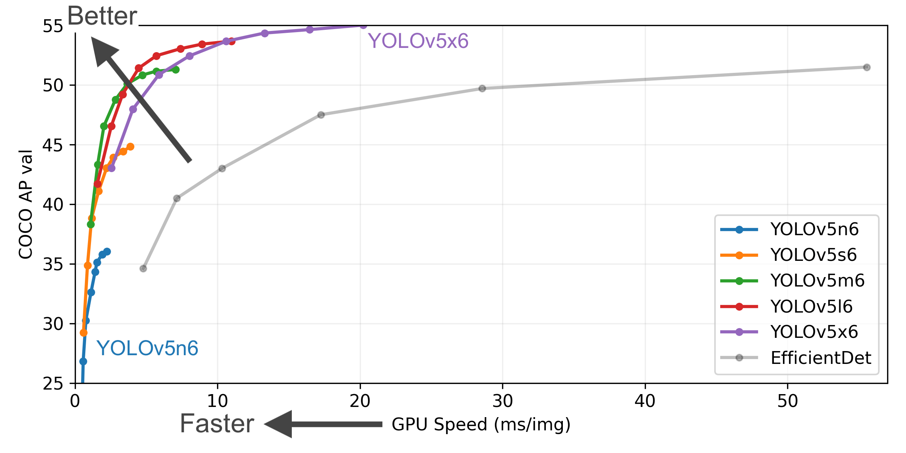
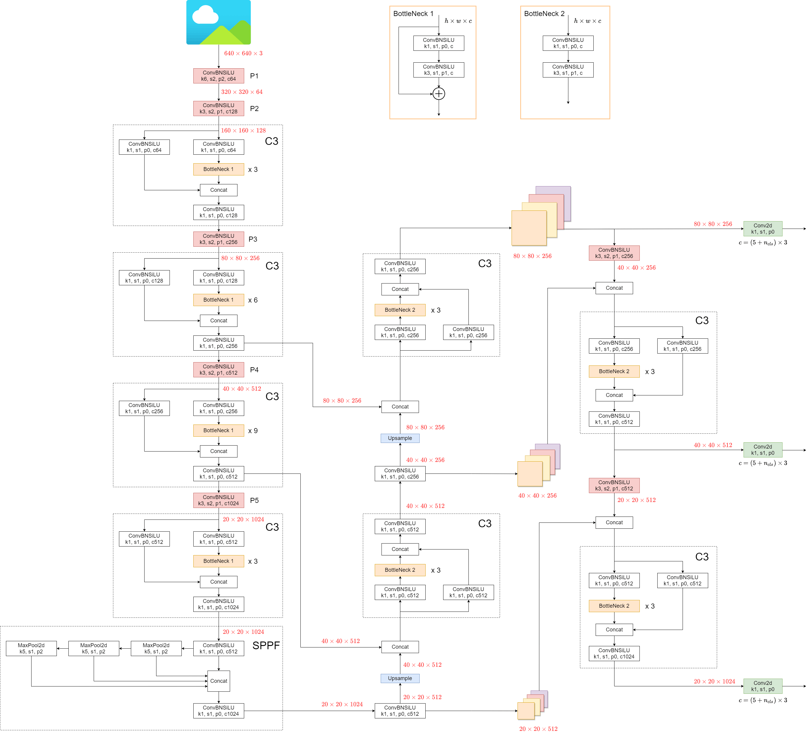

# YoloV5

## Code Source
```
# ultralytics
link: https://github.com/ultralytics/yolov5
branch: v6.1
commit: 3752807c0b8af03d42de478fbcbf338ec4546a6c

# ultralytics
link: https://github.com/ultralytics/yolov5
branch: v7.0
commit: 915bbf294bb74c859f0b41f1c23bc395014ea679

# mmyolo
https://github.com/open-mmlab/mmyolo/tree/v0.1.3
branch v0.1.3
commit 178b0bf3ffec1353923460670bcbafccc15121cf
```

## Model Arch

### pre-processing

yolov5系列的预处理主要是对输入图片利用`letterbox`算子进行resize，然后进行归一化

### post-processing

yolov5系列的后处理操作是利用anchor以及网络预测特征图进行box decode，然后进行nms操作

### backbone

yolov5网络backbone采用了CSP结构以及SPPF结构



### head

yolov5网络head层利用FPN+PAN的结构，融合不同维度的特征，最后有三个输出头，分别对应8、16、32的stride，不同stride的输出预测不同尺寸的目标;

训练时，yolov5在网格上生成相应的anchor框和其对应的cls以及conf。box loss采用了CIOU的方式来进行回归，conf以及cls loss使用BCEWithLogitsLoss

### common

- SPPF
- letterbox
- CIoU Loss

## Model Info

### 模型性能

| 模型  | 源码 | mAP@.5 | mAP@.5:.95 | flops(G) | params(M) | input size |
| :---: | :--: | :--: | :--: | :---: | :----: | :--------: |
| yolov5n |[yolov5](https://github.com/ultralytics/yolov5/tree/v6.1)|   36.1   |   23.1   |   4.5    |    1.9    |        640    |
| yolov5s |[yolov5](https://github.com/ultralytics/yolov5/tree/v6.1)|   48.4   |   32.9   |   16.5    |    7.2   |        640    |
| yolov5m |[yolov5](https://github.com/ultralytics/yolov5/tree/v6.1)|   56.3   |   40.7   |   49.0    |    21.2    |        640    |
| yolov5l |[yolov5](https://github.com/ultralytics/yolov5/tree/v6.1)|   60.0   |   44.5   |   109.1    |    46.5    |        640    |
| yolov5x |[yolov5](https://github.com/ultralytics/yolov5/tree/v6.1)|   61.8   |   46.3   |  205.7   |    86.7    |        640    |
| yolov5n6 |[yolov5](https://github.com/ultralytics/yolov5/tree/v6.1)|   37.2   |   25.4   |   4.6    |    3.2    |        640    |
| yolov5s6 |[yolov5](https://github.com/ultralytics/yolov5/tree/v6.1)|   48.9   |   34.2   |   16.8    |    12.6   |        640    |
| yolov5m6 |[yolov5](https://github.com/ultralytics/yolov5/tree/v6.1)|   56.5   |   41.8   |   50.0   |    35.7    |        640    |
| yolov5l6 |[yolov5](https://github.com/ultralytics/yolov5/tree/v6.1)|   59.7   |   44.7   |   111.4    |   76.8    |        640    |
| yolov5x6 |[yolov5](https://github.com/ultralytics/yolov5/tree/v6.1)|   61.3   |   46.3   |  209.8   |    140.7    |        640    |
| yolov5n |[yolov5](https://github.com/ultralytics/yolov5/tree/v6.1)|   33.5   |   21.4   |   1.9    |    1.9    |        416    |
| yolov5s |[yolov5](https://github.com/ultralytics/yolov5/tree/v6.1)|   44.7   |   30.3   |   7.0    |    7.2   |        416    |
| yolov5m |[yolov5](https://github.com/ultralytics/yolov5/tree/v6.1)|   51.8   |   37.2   |   20.7    |    21.2    |        416    |
| yolov5l |[yolov5](https://github.com/ultralytics/yolov5/tree/v6.1)|   55.7   |   41.0   |   46.1    |    46.5    |        416    |
| yolov5x |[yolov5](https://github.com/ultralytics/yolov5/tree/v6.1)|   58.1   |   43.0   |  86.9   |    86.7    |        416    |
| yolov5n |[yolov5](https://github.com/ultralytics/yolov5/tree/v6.1)|   29.0   |   18.5   |   1.1    |    1.9    |        320    |
| yolov5s |[yolov5](https://github.com/ultralytics/yolov5/tree/v6.1)|   40.0   |   26.8   |   4.1    |    7.2   |        320    |
| yolov5m |[yolov5](https://github.com/ultralytics/yolov5/tree/v6.1)|   47.9   |   33.9   |   12.2    |    21.2    |        320    |
| yolov5l |[yolov5](https://github.com/ultralytics/yolov5/tree/v6.1)|   51.5   |   37.5   |   27.3    |    46.5    |        320    |
| yolov5x |[yolov5](https://github.com/ultralytics/yolov5/tree/v6.1)|   53.9   |   39.4   |  51.4   |    86.7    |        320    |
| yolov5n6 |[yolov5](https://github.com/ultralytics/yolov5/tree/v6.1)|  22.1    |  14.4    |   1.1    |    3.2    |        320    |
| yolov5s6 |[yolov5](https://github.com/ultralytics/yolov5/tree/v6.1)|  31.9    |  21.7    |   4.2    |    12.6   |        320    |
| yolov5m6 |[yolov5](https://github.com/ultralytics/yolov5/tree/v6.1)|  42.7    |  30.6    |   12.5   |    35.7    |        320    |
| yolov5l6 |[yolov5](https://github.com/ultralytics/yolov5/tree/v6.1)|  46.4    |  33.7    |   27.8    |   76.8    |        320    |
| yolov5x6 |[yolov5](https://github.com/ultralytics/yolov5/tree/v6.1)|  48.3    |  35.2    |  52.4   |    140.7    |        320    |
| yolov5n6 |[yolov5](https://github.com/ultralytics/yolov5/tree/v6.1)|  41.8    |  28.9    |   9.0    |    3.2    |        896    |
| yolov5s6 |[yolov5](https://github.com/ultralytics/yolov5/tree/v6.1)|  53.1    |  38.0    |   33.0    |    12.6   |        896    |
| yolov5m6 |[yolov5](https://github.com/ultralytics/yolov5/tree/v6.1)|  59.7    |  44.9    |   98.0   |    35.7    |        896    |
| yolov5l6 |[yolov5](https://github.com/ultralytics/yolov5/tree/v6.1)|  62.6    |  47.5    |   218.3    |   76.8    |        896    |
| yolov5x6 |[yolov5](https://github.com/ultralytics/yolov5/tree/v6.1)|  63.7    |  48.5    |  411.2   |    140.7    |        896    |
| yolov5n |[mmyolo](https://github.com/open-mmlab/mmyolo/tree/v0.1.3/configs/yolov5)|  -   |  28.0    |  5.071   |    1.872    |        640    |
| yolov5s |[mmyolo](https://github.com/open-mmlab/mmyolo/tree/v0.1.3/configs/yolov5)|  -   |  37.7    |  18.473   |    7.235    |        640    |
| yolov5m |[mmyolo](https://github.com/open-mmlab/mmyolo/tree/v0.1.3/configs/yolov5)|  -   |  45.3    |  54.710   |    21.191    |        640    |
| yolov5l |[mmyolo](https://github.com/open-mmlab/mmyolo/tree/v0.1.3/configs/yolov5)|  -   |  48.8    |  121.763   |    46.564    |        640    |
| yolov5n6 |[mmyolo](https://github.com/open-mmlab/mmyolo/tree/v0.1.3/configs/yolov5)|  -   |  35.9    |  20.637   |    3.181    |        1280    |
| yolov5s6 |[mmyolo](https://github.com/open-mmlab/mmyolo/tree/v0.1.3/configs/yolov5)|  -   |  44.4    |  75.403   |    12.496    |        1280    |
| yolov5m6 |[mmyolo](https://github.com/open-mmlab/mmyolo/tree/v0.1.3/configs/yolov5)|  -   |  51.3    |  223.311   |    35.536    |        1280    |
| yolov5l6 |[mmyolo](https://github.com/open-mmlab/mmyolo/tree/v0.1.3/configs/yolov5)|  -   |  53.7    |  496.828   |    76.509    |        1280    |

> Note: 此精度基于官方模型，使用--confidence_threshold 0.25 --nms_threshold 0.45参数，测试所得精度。和官方仓库给的存在差异（--confidence_threshold 0.001 --nms_threshold 0.65`）

### 测评数据集说明


[MS COCO](https://cocodataset.org/#download)的全称是Microsoft Common Objects in Context，是微软于2014年出资标注的Microsoft COCO数据集，与ImageNet竞赛一样，被视为是计算机视觉领域最受关注和最权威的比赛数据集之一。 

COCO数据集支持目标检测、关键点检测、实力分割、全景分割与图像字幕任务。在图像检测任务中，COCO数据集提供了80个类别，验证集包含5000张图片，上表的结果即在该验证集下测试。

### 评价指标说明

- mAP: mean of Average Precision, 检测任务评价指标，多类别的AP的平均值；AP即平均精度，是Precision-Recall曲线下的面积
- mAP@.5: 即将IoU设为0.5时，计算每一类的所有图片的AP，然后所有类别求平均，即mAP
- mAP@.5:.95: 表示在不同IoU阈值（从0.5到0.95，步长0.05）上的平均mAP

## Build_In Deploy

- [ultralytics_deploy](./source_code/ultralytics_deploy.md)
- [ultralytics_deploy_dynamic](./source_code/ultralytics_deploy_dynamic.md)
    > 指动态输入尺寸，模型支持在一定范围内动态输入尺寸，该范围由模型yaml文件内的`input`参数决定

## Tips
- YOLO系列模型中，官方在精度测试和性能测试时，设定了不同的conf和iou参数
- VACC在不同测试任务中，需要分别配置build yaml内的对应参数，分别进行build模型
- `precision mode：--confidence_threshold 0.001 --nms_threshold 0.65`
- `performance mode：--confidence_threshold 0.25 --nms_threshold 0.45`
- build/sub_graph下的yaml文件，与常见的模型yaml文件稍有不同。由于瀚博推理卡硬件资源限制，在处理大尺寸输入时，需要将部分层进行切分，这样能提高推理性能，这里通过编译参数`split_convergence_points`来指定切分点。需要注意的是，切分点需要根据模型结构进行配置，切分点配置错误会导致模型无法正常推理。
