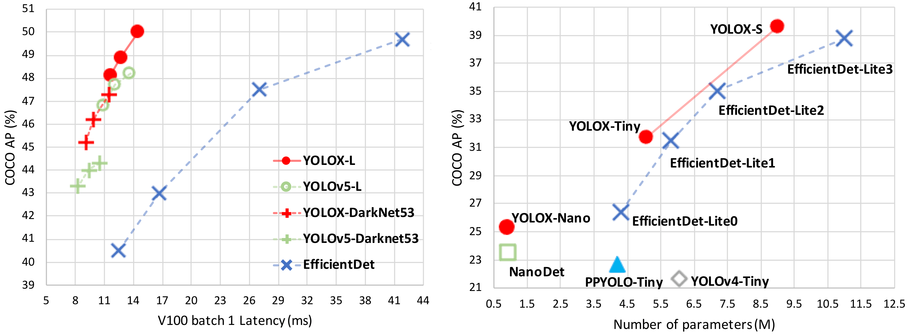
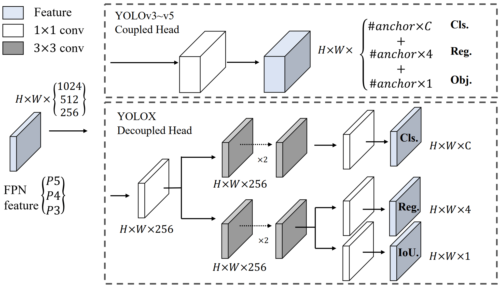

# YOLOX

[YOLOX: Exceeding YOLO Series in 2021](https://arxiv.org/abs/2107.08430)

## Code Source
```
# official
link: https://github.com/Megvii-BaseDetection/YOLOX/tree/0.3.0
branch: 0.3.0
commit: 419778480ab6ec0590e5d3831b3afb3b46ab2aa3

# mmyolo
link: https://github.com/open-mmlab/mmyolo
branch: main
commit: dc85144fab20a970341550794857a2f2f9b11564
```

## Model Arch

### pre-processing

yolox系列的预处理主要是对输入图片利用`letterbox`算子进行resize，然后送入网络forward即可

### post-processing

yolox系列的后处理操作是利用网络预测特征图进行box decode，然后进行nms操作

### backbone

yolox系列是以YOLOv3作为模型的原始框架（YOLOv3网络中使用的算子更加简单，应用范围更加广），然后设计Decoupled Head、Data Aug、Anchor Free以及SimOTA部件

以yolox-darknet53为例，整个模型结构如下图所示


### head

原来的YOLO系列都采用了一个耦合在一起的检测头，同时进行分类、回归的检测任务。YOLOX在结构上采用了Decoupled Head（见下图），将特征平行分成两路卷积特征，同时为了降低参数量提前进行了降维处理，其好处在于：在检测的过程中分类需要的特征和回归所需要的特征不同，所以在Decoupled Head中进行解耦处理后学习的过程会变得更加简单。采用了Decoupled Head后，网络的收敛速度在训练早期要明显快于YOLO head



yolox网络head层利用FPN的结构，融合不同维度的特征，最后有三个输出头，分别对应8、16、32的stride，不同stride的输出预测不同尺寸的目标

### common

- Decoupled Head
- SimOTA
- Mosaic
- Mixup

## Model Info

### 模型性能

| 模型  | 源码 | mAP@.5 | mAP@.5:.95 | flops(G) | params(M) | input size |
| :---: | :--: | :--: | :--: | :---: | :----: | :--------: |
| yolox_s |[yolox](https://github.com/Megvii-BaseDetection/YOLOX/tree/0.3.0)|   52.8   |  34.9    |   68.62    |    8.97    |        1024    |
| yolox_m |[yolox](https://github.com/Megvii-BaseDetection/YOLOX/tree/0.3.0)|   59.7   |  41.9    |   188.81    |    25.33   |        1024    |
| yolox_l |[yolox](https://github.com/Megvii-BaseDetection/YOLOX/tree/0.3.0)|   63.3   |   45.5   |   398.47    |    54.21    |        1024    |
| yolox_x |[yolox](https://github.com/Megvii-BaseDetection/YOLOX/tree/0.3.0)|   64.2   |   46.7   |   721.74    |    99.07    |        1024    |
| yolox_darknet |[yolox](https://github.com/Megvii-BaseDetection/YOLOX/tree/0.3.0)|   60.9   |   42.7   |  474.3   |    63.72    |        1024    |
| yolox_tiny |[yolox](https://github.com/Megvii-BaseDetection/YOLOX/tree/0.3.0)|   42.6   |   25.9   |   39.09    |    5.06    |        1024    |
| yolox_nano |[yolox](https://github.com/Megvii-BaseDetection/YOLOX/tree/0.3.0)|   33.7   |   19.5   |   6.54    |    0.91   |        1024    |
| yolox_s |[yolox](https://github.com/Megvii-BaseDetection/YOLOX/tree/0.3.0)|   53.6   |  36.3    |   52.54    |    8.97    |        896    |
| yolox_m |[yolox](https://github.com/Megvii-BaseDetection/YOLOX/tree/0.3.0)|   60.0   |  43.1    |   144.56    |    25.33   |        896    |
| yolox_l |[yolox](https://github.com/Megvii-BaseDetection/YOLOX/tree/0.3.0)|   63.0   |   46.2   |   305.08    |    54.21    |        896    |
| yolox_x |[yolox](https://github.com/Megvii-BaseDetection/YOLOX/tree/0.3.0)|   64.3   |   47.8   |   552.58    |    99.07    |        896    |
| yolox_darknet |[yolox](https://github.com/Megvii-BaseDetection/YOLOX/tree/0.3.0)|   61.5   |   44.0   |  363.13   |    63.72    |        896    |
| yolox_tiny |[yolox](https://github.com/Megvii-BaseDetection/YOLOX/tree/0.3.0)|   45.5   |   28.3   |   29.93    |    5.06    |        896    |
| yolox_nano |[yolox](https://github.com/Megvii-BaseDetection/YOLOX/tree/0.3.0)|   36.4   |   21.5   |   5.01    |    0.91   |        896    |
| yolox_s |[yolox](https://github.com/Megvii-BaseDetection/YOLOX/tree/0.3.0)|   51.7   |  36.3    |   26.81    |    8.97    |        640    |
| yolox_m |[yolox](https://github.com/Megvii-BaseDetection/YOLOX/tree/0.3.0)|   58.2   |  42.5    |   73.76    |    25.33   |        640    |
| yolox_l |[yolox](https://github.com/Megvii-BaseDetection/YOLOX/tree/0.3.0)|   60.9   |   45.5   |   155.65    |    54.21    |        640    |
| yolox_x |[yolox](https://github.com/Megvii-BaseDetection/YOLOX/tree/0.3.0)|   62.3   |   46.9   |   281.93    |    99.07    |        640    |
| yolox_darknet |[yolox](https://github.com/Megvii-BaseDetection/YOLOX/tree/0.3.0)|   59.8   |   43.5   |  185.27   |    63.72    |        640    |
| yolox_tiny |[yolox](https://github.com/Megvii-BaseDetection/YOLOX/tree/0.3.0)|   47.0   |   31.0   |   15.27    |    5.06    |        640    |
| yolox_nano |[yolox](https://github.com/Megvii-BaseDetection/YOLOX/tree/0.3.0)|   38.3   |   24.1   |   2.55    |    0.91   |        640    |
| yolox_s |[yolox](https://github.com/Megvii-BaseDetection/YOLOX/tree/0.3.0)|   45.0   |  31.6    |   11.33    |    8.97    |        416    |
| yolox_m |[yolox](https://github.com/Megvii-BaseDetection/YOLOX/tree/0.3.0)|   51.6   |  37.7    |   31.16    |    25.33   |        416    |
| yolox_l |[yolox](https://github.com/Megvii-BaseDetection/YOLOX/tree/0.3.0)|   54.6   |   40.7   |   65.76    |    54.21    |        416    |
| yolox_x |[yolox](https://github.com/Megvii-BaseDetection/YOLOX/tree/0.3.0)|   56.1   |   42.1   |   119.12    |    99.07    |        416    |
| yolox_darknet |[yolox](https://github.com/Megvii-BaseDetection/YOLOX/tree/0.3.0)|   54.4   |   39.4   |  78.28   |    63.72    |        416    |
| yolox_tiny |[yolox](https://github.com/Megvii-BaseDetection/YOLOX/tree/0.3.0)|   42.8   |   28.9   |   6.45    |    5.06    |        416    |
| yolox_nano |[yolox](https://github.com/Megvii-BaseDetection/YOLOX/tree/0.3.0)|   34.5   |   22.3   |   1.08    |    0.91   |        416    |
| yolox_s |[yolox](https://github.com/Megvii-BaseDetection/YOLOX/tree/0.3.0)|   39.1   |  27.2    |   6.70    |    8.97    |        320    |
| yolox_m |[yolox](https://github.com/Megvii-BaseDetection/YOLOX/tree/0.3.0)|   46.5   |  33.7    |   18.44    |    25.33   |        320    |
| yolox_l |[yolox](https://github.com/Megvii-BaseDetection/YOLOX/tree/0.3.0)|   50.4   |   37.3   |   38.91    |    54.21    |        320    |
| yolox_x |[yolox](https://github.com/Megvii-BaseDetection/YOLOX/tree/0.3.0)|   51.3   |   38.3   |   70.48    |    99.07    |        320    |
| yolox_darknet |[yolox](https://github.com/Megvii-BaseDetection/YOLOX/tree/0.3.0)|   49.6   |   35.6   |  46.32   |    63.72    |        320    |
| yolox_tiny |[yolox](https://github.com/Megvii-BaseDetection/YOLOX/tree/0.3.0)|   37.9   |   25.5   |   3.82    |    5.06    |        320    |
| yolox_nano |[yolox](https://github.com/Megvii-BaseDetection/YOLOX/tree/0.3.0)|   29.9   |   19.3   |   0.64    |    0.91   |        320    |
| yolox_s |[mmyolo](https://github.com/open-mmlab/mmyolo/blob/main/configs/yolox/README.md)|   59.6   |   40.7   |   29.919    |    8.968    |        640    |
| yolox_tiny |[mmyolo](https://github.com/open-mmlab/mmyolo/blob/main/configs/yolox/README.md)|   50.3   |   32.7   |   17.065    |    5.056    |        640    |

### 测评数据集说明


[MS COCO](https://cocodataset.org/#download)的全称是Microsoft Common Objects in Context，是微软于2014年出资标注的Microsoft COCO数据集，与ImageNet竞赛一样，被视为是计算机视觉领域最受关注和最权威的比赛数据集之一。 

COCO数据集支持目标检测、关键点检测、实力分割、全景分割与图像字幕任务。在图像检测任务中，COCO数据集提供了80个类别，验证集包含5000张图片，上表的结果即在该验证集下测试。

### 评价指标说明

- mAP: mean of Average Precision, 检测任务评价指标，多类别的AP的平均值；AP即平均精度，是Precision-Recall曲线下的面积
- mAP@.5: 即将IoU设为0.5时，计算每一类的所有图片的AP，然后所有类别求平均，即mAP
- mAP@.5:.95: 表示在不同IoU阈值（从0.5到0.95，步长0.05）上的平均mAP

## Build_In Deploy

- [official_deploy](./source_code/official_deploy.md)
- [mmyolo_deploy](./source_code/mmyolo_deploy.md)

## Tips
- YOLO系列模型中，官方在精度测试和性能测试时，设定了不同的conf和iou参数
- VACC在不同测试任务中，需要分别配置build yaml内的对应参数，分别进行build模型
- `precision mode：--confidence_threshold 0.001 --nms_threshold 0.65`
- `performance mode：--confidence_threshold 0.25 --nms_threshold 0.45`