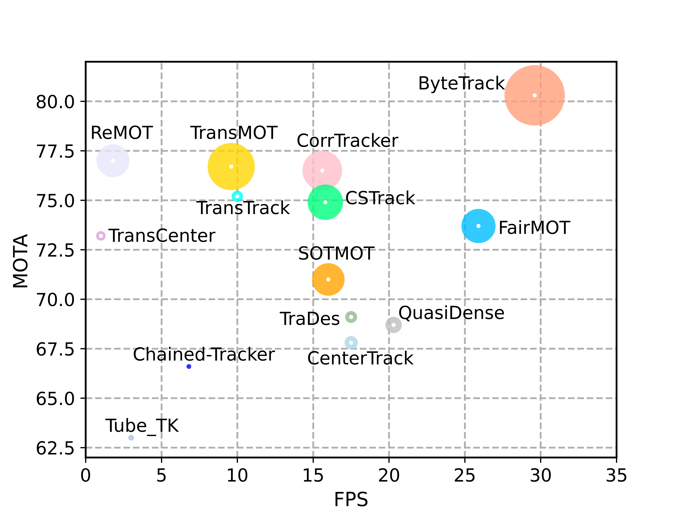
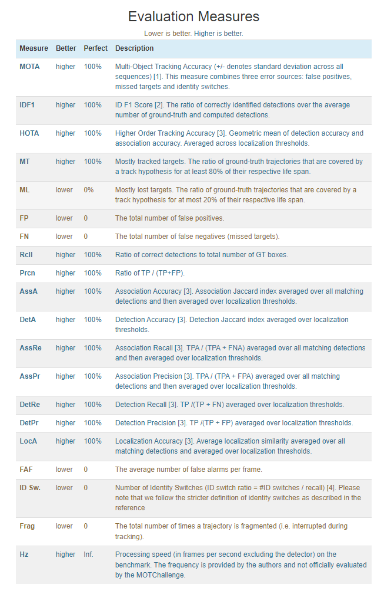
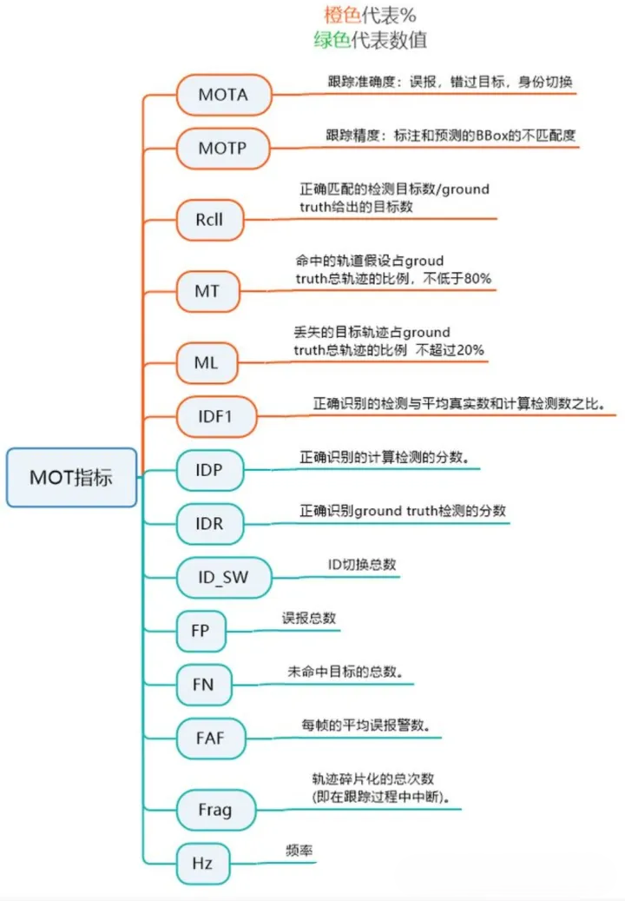
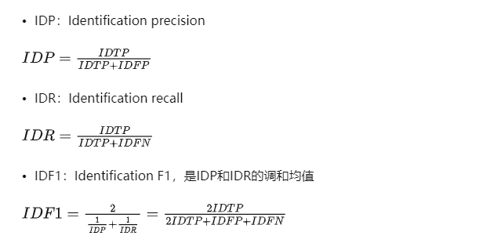

# ByteTrack



## Code Source
```
link: https://github.com/ifzhang/ByteTrack
branch: main
commit: d1bf0191adff59bc8fcfeaa0b33d3d1642552a99
```

## Model Arch

ByteTrack是基于tracking-by-detection范式的跟踪方法。作者提出了一种简单高效的数据关联方法BYTE。它和之前跟踪算法的最大区别在于，并不是简单的去掉低分检测结果，正如论文标题所述，Assiciating Every Detection Box。利用检测框和跟踪轨迹之间的相似性，在保留高分检测结果的同时，从低分检测结果中去除背景，挖掘出真正的物体（遮挡、模糊等困难样本），从而降低漏检并提高轨迹的连贯性。速度到 30 FPS（单张 V100），各项指标均有突破。相比 deep sort，ByteTrack 在遮挡情况下的提升非常明显。但是需要注意的是，由于ByteTrack 没有采用外表特征进行匹配，所以跟踪的效果非常依赖检测的效果，也就是说如果检测器的效果很好，跟踪也会取得不错的效果，但是如果检测的效果不好，那么会严重影响跟踪的效果。

ByteTrack 的核心在于 BYTE，也就是说可以套用任何你自己的检测算法，把你的检测结果输入跟踪器即可，和 deepsort 类似，这种方式相比 JDE 和 FairMOT，在工程应用上更为简洁。官方实现中检测算法基于`yolox`实现。

### 跟踪算法流程

前面提到作者保留了低分检测框，直接当做高分检测框处理显然是不合理的，那样会带来很多背景（false positive）。BYTE 数据关联方法具体的流程如下：

- 根据检测框得分，把检测框分为高分框和低分框，分开处理
- 第一次使用高分框和之前的跟踪轨迹进行匹配
- 第二次使用低分框和第一次没有匹配上高分框的跟踪轨迹（例如在当前帧受到严重遮挡导致得分下降的物体）进行匹配
- 对于没有匹配上跟踪轨迹，得分又足够高的检测框，我们对其新建一个跟踪轨迹。对于没有匹配上检测框的跟踪轨迹，我们会保留30帧，在其再次出现时再进行匹配

BYTE 的工作原理可以理解为，遮挡往往伴随着检测得分由高到低的缓慢降低：被遮挡物体在被遮挡之前是可视物体，检测分数较高，建立轨迹；当物体被遮挡时，通过检测框与轨迹的位置重合度就能把遮挡的物体从低分框中挖掘出来，保持轨迹的连贯性。

### 检测算法

`ByteTrack`中检测模块基于`yolox`实现，相比于[modelzoo-yolox](../../detection/yolox/source_code/official_deploy.md)涉及到的`yolox`算法，主要区别在于预处理以及类别数，`bytetrack`实现中`yolox`算法的预处理定义如下

```python
def preproc(image, input_size, mean, std, swap=(2, 0, 1)):
    if len(image.shape) == 3:
        padded_img = np.ones((input_size[0], input_size[1], 3)) * 114.0
    else:
        padded_img = np.ones(input_size) * 114.0
    img = np.array(image)
    r = min(input_size[0] / img.shape[0], input_size[1] / img.shape[1])
    resized_img = cv2.resize(
        img,
        (int(img.shape[1] * r), int(img.shape[0] * r)),
        interpolation=cv2.INTER_LINEAR,
    ).astype(np.float32)
    padded_img[: int(img.shape[0] * r), : int(img.shape[1] * r)] = resized_img

    padded_img = padded_img[:, :, ::-1]
    padded_img /= 255.0
    if mean is not None:
        padded_img -= mean
    if std is not None:
        padded_img /= std
    padded_img = padded_img.transpose(swap)
    padded_img = np.ascontiguousarray(padded_img, dtype=np.float32)
    return padded_img, r

mean = (0.485, 0.456, 0.406)
std = (0.229, 0.224, 0.225)
```

### common

- focus layer
- letterbox
- Decoupled Head
- SimOTA
- Mosaic
- Mixup

## Model Info

### 模型性能

| 模型  | 源码 | MOTA | IDF1 | IDs | dataset | input size |
| :---: | :--: | :--: | :--: | :---: | :----: | :--------: |
| ByteTrack_ablation |[official](https://github.com/ifzhang/ByteTrack)|   	76.6  |  79.3    |   159    |    MOT17    |       800x1440    |
| bytetrack_x_mot17 |[official](https://github.com/ifzhang/ByteTrack)|   	90.0  |  83.3    |   422    |    MOT17    |       800x1440    |
| bytetrack_l_mot17 |[official](https://github.com/ifzhang/ByteTrack)|   	88.7  |  80.7    |   460    |    MOT17    |       800x1440    |
| bytetrack_m_mot17 |[official](https://github.com/ifzhang/ByteTrack)|   	87.0  |  80.1    |   477    |    MOT17    |       800x1440    |
| bytetrack_s_mot17 |[official](https://github.com/ifzhang/ByteTrack)|   	79.2  |  74.3    |   533    |    MOT17    |       608x1088    |
| bytetrack_nano_mot17 |[official](https://github.com/ifzhang/ByteTrack)|   	69.0  |  66.3    |   531    |    MOT17    |       608x1088    |
| bytetrack_tiny_mot17 |[official](https://github.com/ifzhang/ByteTrack)|   	77.1  |  71.5    |   519    |    MOT17    |       608x1088    |
| bytetrack_x_mot20  |[official](https://github.com/ifzhang/ByteTrack)|   	93.4  |  89.3    |   1057    |    MOT20    |       896x1600    |

### 测评数据集说明

目前多目标跟踪算法中常用数据集为MOT17与MOT20，两者标签格式基本相同，MOT20数据集主要的特点是密集人群跟踪

### 评价指标说明





#### Classical metrics

*   _**MT**_：Mostly Tracked trajectories，成功跟踪的帧数占总帧数的80%以上的GT轨迹数量
    
*   Fragments：碎片数，成功跟踪的帧数占总帧数的80%以下的预测轨迹数量
    
*   _**ML**_：Mostly Lost trajectories，成功跟踪的帧数占总帧数的20%以下的GT轨迹数量
    
*   False trajectories：预测出来的轨迹匹配不上GT轨迹，相当于跟踪了个寂寞
    
*   ID switches：因为跟踪的每个对象都是有ID的，一个对象在整个跟踪过程中ID应该不变，但是由于跟踪算法不强大，总会出现一个对象的ID发生切换，这个指标就说明了ID切换的次数，指前一帧和后一帧中对于相同GT轨迹的预测轨迹ID发生切换，跟丢的情况不计算在ID切换中。
    

#### CLEAR MOT metrics

*   _**FP**_：总的误报数量，即整个视频中的FP数量，即对每帧的FP数量求和
    
*   _**FN**_：总的漏报数量，即整个视频中的FN数量，即对每帧的FN数量求和
    
*   _**Fragm（FM）**_：总的fragmentation数量，every time a ground truth object tracking is interrupted and later resumed is counted as a fragmentation，注意这个指标和Classical metrics中的Fragments有点不一样
    
*   _**IDSW**_：总的ID Switch数量，即整个视频中的ID Switch数量，即对每帧发生的ID Switch数量求和，这个和Classical metrics中的ID switches基本一致
    
*   _**MOTA**_：注意MOTA最大为1，由于IDSW的存在，MOTA最小可以为负无穷。
    

*   _**MOTP**_：衡量跟踪的位置误差
    

#### ID scores



## Build_In Deploy

`ByteTrack`跟踪算法中部署主要是对检测算法`yolox`进行模型转换以及部署，精度测试可以基于`MOT17`数据集在检测算法后接`track`模块进行测试

### step.1 获取预训练模型
基于[bytetrack](https://github.com/ifzhang/ByteTrack)，转换检测模型至onnx格式可运行如下脚本

```
python tools/export_onnx.py --input input -f exps/example/mot/yolox_x_mix_mot20_ch.py  -c models/bytetrack_x_mot20.tar --output-name bytetrack_x_mot20.onnx
```


### step.2 准备数据集
- [校准数据集](https://motchallenge.net/)
- [评估数据集](https://motchallenge.net/)

### step.3 模型转换
1. 根据具体模型，修改编译配置
    - [official_bytetrack.yaml](./build_in/build/official_bytetrack.yaml)
    
    > - runstream推理，编译参数`backend.type: tvm_vacc`
    > - fp16精度: 编译参数`backend.dtype: fp16`
    > - int8精度: 编译参数`backend.dtype: int8`，需要配置量化数据集和预处理算子

2. 模型编译

    ```bash
    cd bytetrack
    mkdir workspace
    cd workspace
    vamc compile ./build_in/build/official_bytetrack.yaml
    ```

### step.4 模型推理
1. runstream
    - 参考：[eval_vsx.py](./build_in/vsx/python/eval_vsx.py)
    ```bash
    python ./build_in/vsx/python/eval_vsx.py \
        --model_prefix_path deploy_weights/official_bytetrack_run_stream_int8/mod \
        --vdsp_params_info ./build_in/vdsp_params/official-bytetrack_tiny_mot17-vdsp_params.json \
        --path /path/to/mot/MOT17/train \
        --result_dir result/track_eval
    ```

    <details><summary>点击查看精度测试结果</summary>

    ```
    # fp16
                    Rcll  Prcn  GT    MT    PT    ML   FP    FN  IDs   FM  MOTA  MOTP num_objects
    MOT17-02-FRCNN 56.9% 97.1%  62 17.7% 56.5% 25.8% 1.7% 43.1% 0.5% 1.2% 54.7% 0.189       18581
    MOT17-04-FRCNN 87.3% 99.6%  83 72.3% 24.1%  3.6% 0.4% 12.7% 0.1% 0.9% 86.8% 0.124       47557
    MOT17-11-FRCNN 80.2% 98.0%  75 48.0% 34.7% 17.3% 1.7% 19.8% 0.4% 0.7% 78.1% 0.132        9436
    MOT17-10-FRCNN 72.5% 95.5%  57 36.8% 59.6%  3.5% 3.4% 27.5% 1.0% 2.2% 68.1% 0.218       12839
    MOT17-05-FRCNN 71.5% 97.7% 133 35.3% 45.9% 18.8% 1.7% 28.5% 0.7% 1.6% 69.1% 0.161        6917
    MOT17-13-FRCNN 61.8% 96.6% 110 33.6% 38.2% 28.2% 2.2% 38.2% 0.5% 1.4% 59.1% 0.206       11642
    MOT17-09-FRCNN 76.0% 99.6%  26 53.8% 42.3%  3.8% 0.3% 24.0% 0.3% 1.2% 75.3% 0.142        5325
    OVERALL        75.8% 98.3% 546 41.4% 41.9% 16.7% 1.3% 24.2% 0.4% 1.2% 74.1% 0.153      112297
                    IDF1   IDP   IDR  Rcll  Prcn  GT  MT  PT ML   FP    FN IDs    FM  MOTA  MOTP IDt IDa IDm num_objects
    MOT17-02-FRCNN 49.3% 66.7% 39.1% 56.9% 97.1%  62  11  35 16  314  8007  89   227 54.7% 0.189  62  40  15       18581
    MOT17-04-FRCNN 85.1% 91.1% 79.9% 87.3% 99.6%  83  60  20  3  169  6058  44   422 86.8% 0.124  20  24   3       47557
    MOT17-11-FRCNN 77.8% 86.4% 70.7% 80.2% 98.0%  75  36  26 13  158  1870  38    66 78.1% 0.132  18  22   5        9436
    MOT17-10-FRCNN 55.0% 63.7% 48.4% 72.5% 95.5%  57  21  34  2  434  3531 129   286 68.1% 0.218  90  45  12       12839
    MOT17-05-FRCNN 72.5% 85.7% 62.8% 71.5% 97.7% 133  47  61 25  119  1972  46   114 69.1% 0.161  48  28  31        6917
    MOT17-13-FRCNN 64.0% 82.0% 52.4% 61.8% 96.6% 110  37  42 31  252  4451  56   161 59.1% 0.206  51  23  25       11642
    MOT17-09-FRCNN 60.4% 69.8% 53.3% 76.0% 99.6%  26  14  11  1   16  1279  18    64 75.3% 0.142  16   8   6        5325
    OVERALL        71.8% 82.5% 63.6% 75.8% 98.3% 546 226 229 91 1462 27168 420  1340 74.1% 0.153 305 190  97      112297

    # int8
                    Rcll  Prcn  GT    MT    PT    ML   FP    FN  IDs   FM  MOTA  MOTP num_objects
    MOT17-02-FRCNN 55.8% 97.0%  62 21.0% 56.5% 22.6% 1.7% 44.2% 0.4% 1.2% 53.6% 0.189       18581
    MOT17-04-FRCNN 87.0% 99.6%  83 72.3% 24.1%  3.6% 0.3% 13.0% 0.1% 1.0% 86.6% 0.129       47557
    MOT17-11-FRCNN 78.6% 98.0%  75 46.7% 33.3% 20.0% 1.6% 21.4% 0.3% 0.6% 76.7% 0.133        9436
    MOT17-10-FRCNN 70.1% 96.2%  57 31.6% 63.2%  5.3% 2.8% 29.9% 0.9% 2.2% 66.4% 0.218       12839
    MOT17-05-FRCNN 70.6% 98.3% 133 33.8% 43.6% 22.6% 1.2% 29.4% 0.6% 1.5% 68.8% 0.164        6917
    MOT17-13-FRCNN 59.3% 97.3% 110 29.1% 40.9% 30.0% 1.6% 40.7% 0.5% 1.3% 57.1% 0.207       11642
    MOT17-09-FRCNN 75.7% 99.7%  26 53.8% 42.3%  3.8% 0.3% 24.3% 0.4% 1.3% 75.0% 0.144        5325
    OVERALL        74.8% 98.5% 546 39.7% 42.1% 18.1% 1.1% 25.2% 0.3% 1.2% 73.3% 0.156      112297
                    IDF1   IDP   IDR  Rcll  Prcn  GT  MT  PT ML   FP    FN IDs    FM  MOTA  MOTP IDt IDa IDm num_objects
    MOT17-02-FRCNN 51.8% 71.0% 40.8% 55.8% 97.0%  62  13  35 14  318  8218  79   225 53.6% 0.189  54  39  17       18581
    MOT17-04-FRCNN 86.7% 93.0% 81.2% 87.0% 99.6%  83  60  20  3  148  6186  46   499 86.6% 0.129  16  29   4       47557
    MOT17-11-FRCNN 77.3% 86.9% 69.7% 78.6% 98.0%  75  35  25 15  151  2020  26    57 76.7% 0.133  16  16   8        9436
    MOT17-10-FRCNN 55.4% 65.6% 47.9% 70.1% 96.2%  57  18  36  3  360  3837 115   284 66.4% 0.218  78  47  14       12839
    MOT17-05-FRCNN 71.1% 85.0% 61.1% 70.6% 98.3% 133  45  58 30   85  2032  43   104 68.8% 0.164  47  25  29        6917
    MOT17-13-FRCNN 62.5% 82.5% 50.3% 59.3% 97.3% 110  32  45 33  192  4743  55   150 57.1% 0.207  55  19  24       11642
    MOT17-09-FRCNN 58.9% 68.2% 51.8% 75.7% 99.7%  26  14  11  1   14  1296  19    68 75.0% 0.144  17   8   6        5325
    OVERALL        72.6% 84.2% 63.9% 74.8% 98.5% 546 217 230 99 1268 28332 383  1387 73.3% 0.156 283 183 102      112297

    ```

    </details>

    - 参考[demo_vsx.py](./build_in/vsx/python/demo_vsx.py)运行demo，测试检测跟踪整体pipeline
    ```
    python ./build_in/vsx/python/demo_vsx.py \
        --model_prefix_path deploy_weights/official_bytetrack_run_stream_int8/mod \
        --vdsp_params_info ./build_in/vdsp_params/official-bytetrack_tiny_mot17-vdsp_params.json \
        --path /path/to/palace.mp4 \
        --result_dir result/track_eval
    ```

### step.5 性能测试
**Note:** 基于`tracking by detection`的多目标跟踪算法包括检测、track两个流程，modelzoo只提供检测算法模型的性能测试，整体pipeline性能可使用vastpipe测试。精度采用python脚本计算

1. 性能测试
    ```bash
    vamp -m deploy_weights/official_bytetrack_run_stream_int8/mod --vdsp_params ./build_in/vdsp_params/official-bytetrack_tiny_mot17-vdsp_params.json -i 1 -b 1 -d 0 -p 1
    ```
