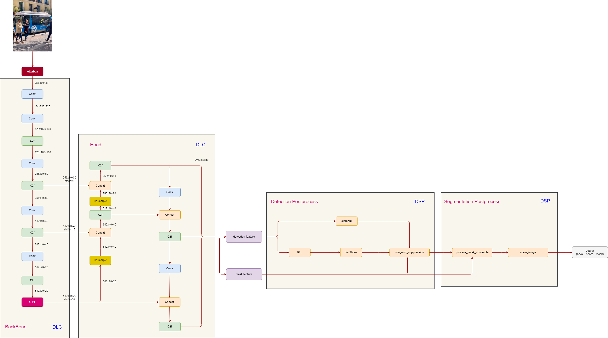

# Yolov8_seg

## Code Source
```
link: https://github.com/ultralytics/ultralytics
branch: main
commit: b1119d512e738
```

## Model Arch




### pre-processing

yolov8_seg系列的预处理主要是对输入图片利用`letterbox`算子进行resize，然后进行归一化

### post-processing

yolov8_seg系列的后处理操作相比于yolov5没有改动，即进行box decode之后进行nms, 然后利用预测得到的box生成掩码

### backbone

Yolov8 backbone和Neck部分参考了YOLOv7 ELAN设计思想，将YOLOv5的C3结构换成了梯度流更丰富的C2f结构，并对不同尺度模型调整了不同的通道数，属于对模型结构精心微调，不再是无脑一套参数应用所有模型，大幅提升了模型性能

### head

yolov8_seg det Head部分和yolov8检测部分类似。det head相比YOLOv5改动较大，换成了目前主流的解耦头结构，将分类和检测头分离，同时也从Anchor-Based换成了Anchor-Free，Loss计算方面采用了TaskAlignedAssigner正样本分配策略，并引入了 Distribution Focal Loss。C2f模块之后是两个seg head， 用于学习输入图像的语义分割和mask

### common

- C2f
- SPPF
- letterbox
- DFL

## Model Info

### 模型性能

| Models  | Code Source | mAP@.5 | mAP@.5:.95 | Flops(B) | Params(M) | Shapes |
| :---: | :--: | :--: | :--: | :---: | :----: | :--------: |
| yolov8n-seg |[ultralytics](https://github.com/ultralytics/ultralytics)|   -   |   30.5   |   12.6    |    3.4    |        640    |
| yolov8s-seg |[ultralytics](https://github.com/ultralytics/ultralytics)|   -   |   36.8   |   42.6    |    11.8   |        640    |
| yolov8m-seg |[ultralytics](https://github.com/ultralytics/ultralytics)|   -   |   40.8   |   110.2    |    27.3    |        640    |
| yolov8l-seg |[ultralytics](https://github.com/ultralytics/ultralytics)|   -   |   42.6   |   220.5    |    46.0    |        640    |
| yolov8x-seg |[ultralytics](https://github.com/ultralytics/ultralytics)|   -   |   43.4   |  344.1   |    71.8    |        640    |

### 测评数据集说明


[MS COCO](https://cocodataset.org/#download)的全称是Microsoft Common Objects in Context，是微软于2014年出资标注的Microsoft COCO数据集，与ImageNet竞赛一样，被视为是计算机视觉领域最受关注和最权威的比赛数据集之一。 

COCO数据集支持目标检测、关键点检测、实例分割、全景分割与图像字幕任务。在图像检测和实例分割任务中，COCO数据集提供了80个类别，验证集包含5000张图片，上表的结果即在该验证集下测试。

### 评价指标说明

- mAP: mean of Average Precision, 多类别的AP的平均值；AP即平均精度，是Precision-Recall曲线下的面积
- mAP@.5: 即将IoU设为0.5时，计算每一类的所有图片的AP，然后所有类别求平均，即mAP
- mAP@.5:.95: 表示在不同IoU阈值（从0.5到0.95，步长0.05）上的平均mAP

## Build_In Deploy
### step.1 模型准备

1. 下载模型权重
    ```
    link: https://github.com/ultralytics/ultralytics
    branch: main
    commit: b1119d512e738
    ```

2. 模型导出

    暂不支持`onnx`，需转为`torchscript`格式，参考：

    ```python
    import torch
    from ultralytics import YOLO

    input_shape = (1, 3, 640, 640)
    img_tensor=torch.zeros(input_shape)
    model = YOLO("yolov8s-seg.pt")
    model.to("cpu")
    scripted_model = torch.jit.trace(model.model, img_tensor, check_trace=False).eval()

    torch.jit.save(scripted_model, 'yolov8_seg.torchscript.pt')
    ```


### step.2 准备数据集
- [校准数据集](http://images.cocodataset.org/zips/val2017.zip)
- [评估数据集](http://images.cocodataset.org/zips/val2017.zip)
- [gt: instances_val2017.json](http://images.cocodataset.org/annotations/annotations_trainval2017.zip)
- [label: coco.txt](../../detection/common/label/coco.txt)


### step.3 模型转换
1. 参考瀚博训推软件生态链文档，获取模型转换工具: [vamc v3.0+](../../../docs/vastai_software.md)
2. 根据具体模型修改模型转换配置文件
    - [yolov8_seg.yaml](./build_in/build/yolov8_seg.yaml)


3. 模型编译
    ```bash
    vamc compile ./build_in/build/yolov8_seg.yaml
    ```

### step.4 模型推理
1. 参考瀚博训推软件生态链文档，获取模型推理工具：[vaststreamx v2.8+](../../../docs/vastai_software.md)
2. runstream推理，参考：[yolov8_seg.py](./build_in/vsx/python/yolov8_seg.py)
    - 依赖自定义算子：[yolov8_seg_post_proc](./build_in/vsx/python/yolov8_seg_post_proc)

    ```bash
    python ./build_in/vsx/python/yolov8_seg.py \
        --file_path  path/to/coco/det_coco_val \
        --model_prefix_path deploy_weights/yolov8s_seg_run_stream_int8/mod \
        --vdsp_params_info ../build_in/vdsp_params/ultralytics-yolov8s_seg-vdsp_params.json \
        --vdsp_custom_op ./yolov8_seg_post_proc  \
        --label_txt path/to/coco/coco.txt \
        --save_dir ./output --device 0
    ```

3. 精度统计：[eval_map.py](./build_in/vsx/python/eval.py)，指定`instances_val2017.json`标签文件和上步骤中的txt保存路径，即可获得mAP评估指标
   ```bash
    python ./build_in/vsx/python/eval.py \
        --gt path/to/instances_val2017.json \
        --pred ./predictions.json
   ```

### step.5 性能精度
1. 参考瀚博训推软件生态链文档，获取模型性能测试工具：[vamp v2.4+](../../../docs/vastai_software.md)

2. 基于[image2npz.py](../common/utils/image2npz.py)，将评估数据集转换为npz格式，生成对应的`npz_datalist.txt`
    ```bash
    python ../common/utils/image2npz.py \
        --dataset_path path/to/coco_val2017 \
        --target_path  path/to/coco_val2017_npz \
        --text_path npz_datalist.txt
    ```
3. 性能测试
    ```bash
    vamp -m deploy_weights/yolov8s_seg-int8-percentile-3_640_640-vacc/yolov8s_seg \
        --vdsp_params ../build_in/vdsp_params/ultralytics-yolov8s_seg-vdsp_params.json \
        -i 2 p 2 -b 1
    ```
4. npz结果输出
    ```bash
    vamp -m deploy_weights/yolov8s_seg-int8-percentile-3_640_640-vacc/yolov8s_seg \
        --vdsp_params ../build_in/vdsp_params/ultralytics-yolov8s_seg-vdsp_params.json \
        -i 2 p 2 -b 1 \
        --datalist npz_datalist.txt \
        --path_output npz_output
    ```

> 可选步骤，和step.4内使用runstream脚本方式的精度测试基本一致

5. [npz_decode.py](./build_in/vsx/python/npz_decode.py)，解析vamp输出的npz文件，生成predictions.json
    ```bash
    python ./build_in/vsx/python/npz_decode.py \
        --label-txt coco.txt \
        --input-image datasets/coco_val2017 \
        --model_size 640 640 \
        --datalist-txt datasets/npz_datalist.txt \
        --vamp-output npz_output
    ```
6. [eval_map.py](./build_in/vsx/python/eval.py)，精度统计，指定`instances_val2017.json`标签文件和上步骤中的txt保存路径，即可获得mAP评估指标
   ```bash
    python ./build_in/vsx/python/eval.py \
        --gt path/to/instances_val2017.json \
        --txt TEMP/predictions.json
   ```