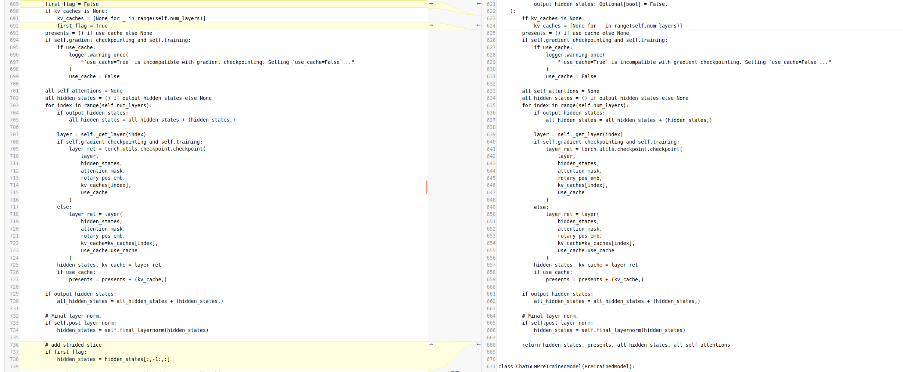
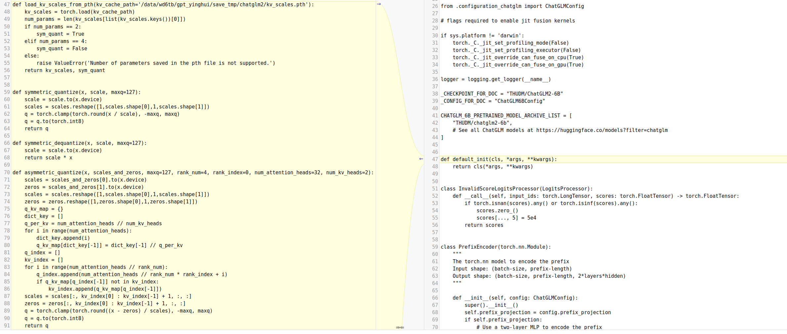
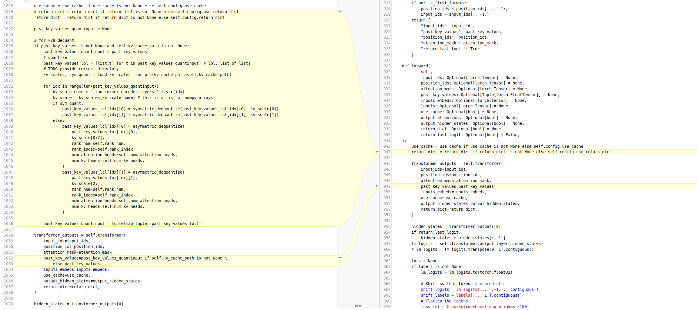
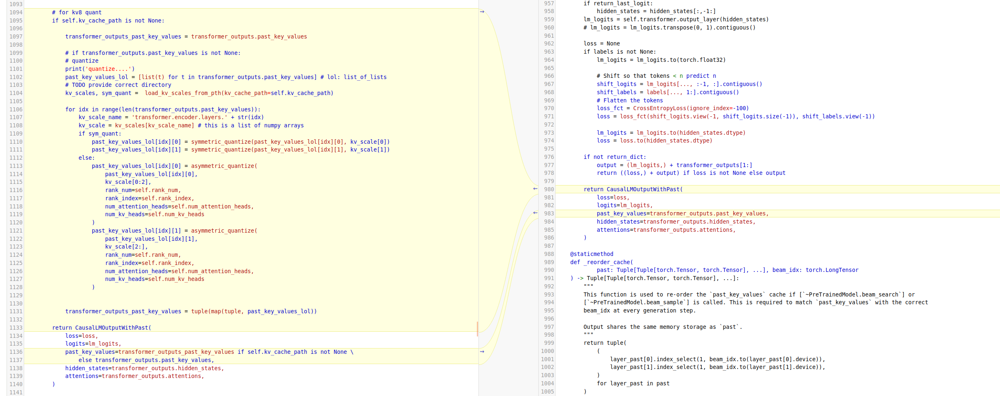

# ChatGLM2

- [GLM: General Language Model Pretraining with Autoregressive Blank Infilling](https://arxiv.org/abs/2103.10360)

## Model Arch


## Model Info

### Support Models

| models  | tips |
| :---: | :--: |
| [THUDM/chatglm2-6b](https://huggingface.co/THUDM/chatglm2-6b) | GQA，[modeling_chatglm2_vacc.py](./build_in/source_code/modeling_chatglm2_vacc.py) |


## TVM_VACC部署

### step.1 模型准备

1. 参考`Support Models`列表下载模型权重
2. 网络修改
- 为了方便部署`ChatGLM`系列模型，在官方源码基础上，对`modeling_chatglm.py`做了一些修改，具体修改如下， 其中左图为修改的代码
- [modeling_chatglm2_vacc.py](./build_in/source_code/modeling_chatglm2_vacc.py)

  - 1. CoreAttention，适应tp切分调整size，不区分torch版本， 统一`forward`函数

  

  - 2. slice，插入slice， 优化推理

  

  - 3. quantization，修改 quantization.py，仅当量化方式为官方默认时修改， vamc-gptq不需要
    ```python
    # 类W8A16Linear新增symbolic函数用于注册自定义算子导出onnx
    class W8A16Linear(torch.autograd.Function):

    + @staticmethod
    + def symbolic(
    + 	g: torch._C.Graph,
    + 	input: torch._C.Value,
    + 	quant_w: torch._C.Value,
    + 	scale_w: torch._C.Value,
    + 	weight_bit_width:torch._C.Value,
    + ):
    + 	from torch.onnx.symbolic_helper import _get_tensor_sizes, _get_tensor_dim_size
    + 	# print('_get_tensor_sizes(input)===', _get_tensor_sizes(input))
    + 	# print('_get_tensor_sizes(quant_w)===', _get_tensor_sizes(quant_w))
    + 	opr_type = input.type().with_sizes(_get_tensor_sizes(input)[:-1] + [_get_tensor_sizes(quant_w)[0],])
    + 	ret = g.op("Vastai::QuantizedLinearPerChannel", input, quant_w, scale_w).setType(opr_type)
    + 	return ret


    # 函数extract_weight_to_half 注释assert cpu用fp32
    def extract_weight_to_half
    - assert scale_list.dtype in [torch.half, torch.bfloat16]
    + # assert scale_list.dtype in [torch.half, torch.bfloat16]

    # 函数 quantize 注释 torch.cuda.current_device()

    ```
- 为了部署chatglm2-kv8模型， modeling.py以上修改的基础上添加对past_key_value的修改， 新增修改如下
- [modeling_chatglm2_vacc.py](./build_in/source_code/modeling_chatglm2_vacc.py)
  - 1. kv_cache 量化与反量化函数定义

  

  

  - 2. 从config获取 kvcache quant 所需参数

  

  - 4. kv_cache反量化与量化

  

  


### step.2 数据集

1. 量化校准数据集：
    - [allenai/c4](https://hf-mirror.com/datasets/allenai/c4/tree/main/en)
        - c4-train.00000-of-01024.json.gz
        - c4-validation.00000-of-00008.json.gz
    - [ceval/ceval-exam](https://hf-mirror.com/datasets/ceval/ceval-exam/tree/main)
        - ceval-exam.zip
    - [yahma/alpaca-cleaned](https://hf-mirror.com/datasets/yahma/alpaca-cleaned/tree/main)
        - alpaca_data_cleaned.json

### step.3 模型转换
1. 根据具体模型修改模型转换配置文件
    - v2/v3/v4模型，编译配置一致
    - [hf_chatglm_fp16.yaml](./build_in/build/hf_chatglm_fp16.yaml)
    - [hf_chatglm_int8.yaml](./build_in/build/hf_chatglm_int8.yaml)
    - [hf_chatglm_kv8.yaml](./build_in/build/hf_chatglm_kv8.yaml)

    > - runstream推理，编译参数`backend.type: tvm_vacc`
    > - fp16精度: 编译参数`backend.dtype: fp16`
    > - int8精度: 编译参数`backend.dtype: int8`
    
    ```bash
    vamc compile ./build_in/build/hf_chatglm_fp16.yaml
    vamc compile ./build_in/build/hf_chatglm_int8.yaml
    vamc compile ./build_in/build/hf_chatglm_kv8.yaml
    ```


### step.4 模型推理
1. 参考大模型部署推理工具：[vastgenx: v1.1.0+](../../docs/vastgenx/README.md)


### Tips
- **LLM模型请先查看概要指引**，[Tips🔔](../README.md)
- 依赖配置
    ```bash
    protobuf==3.20.3
    torch==2.1.0
    onnx==1.14.0
    onnxsim==0.4.35
    onnxruntime==1.13.1
    accelerate==0.25.0
    transformers>=4.31.0 # 推荐4.40
    tiktoken
    ```
