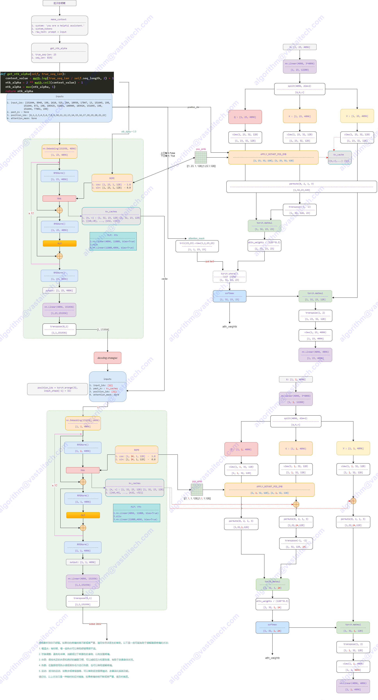

# Qwen3

- Technical Report
    - [Qwen3 Technical Report](https://arxiv.org/abs/2505.09388)
- Huggingface
    - https://huggingface.co/Qwen


## Model Arch




### Qwen3
- 模型结构
    - Qwen3基于Qwen2改进，修改较小，对查询 (Query) 和键 (Key) 添加归一化 (RMSNorm)
- 模型预训练
    - 在预训练方面，Qwen3 的数据集相比 Qwen2.5 有了显著扩展。Qwen2.5是在 18 万亿个 token 上进行预训练的，而 Qwen3 使用的数据量几乎是其两倍，达到了约 36 万亿个 token，涵盖了 119 种语言和方言。为了构建这个庞大的数据集，我们不仅从网络上收集数据，还从 PDF 文档中提取信息。我们使用 Qwen2.5-VL 从这些文档中提取文本，并用 Qwen2.5 改进提取内容的质量。为了增加数学和代码数据的数量，我们利用 Qwen2.5-Math 和 Qwen2.5-Coder 这两个数学和代码领域的专家模型合成数据，合成了包括教科书、问答对以及代码片段等多种形式的数据。
    - 预训练过程分为三个阶段。在第一阶段（S1），模型在超过 30 万亿个 token 上进行了预训练，上下文长度为 4K token。这一阶段为模型提供了基本的语言技能和通用知识。在第二阶段（S2），我们通过增加知识密集型数据（如 STEM、编程和推理任务）的比例来改进数据集，随后模型又在额外的 5 万亿个 token 上进行了预训练。在最后阶段，我们使用高质量的长上下文数据将上下文长度扩展到 32K token，确保模型能够有效地处理更长的输入。
    - 由于模型架构的改进、训练数据的增加以及更有效的训练方法，Qwen3 Dense 基础模型的整体性能与参数更多的Qwen2.5基础模型相当。例如，Qwen3-1.7B/4B/8B/14B/32B-Base 分别与 Qwen2.5-3B/7B/14B/32B/72B-Base 表现相当。特别是在 STEM、编码和推理等领域，Qwen3 Dense 基础模型的表现甚至超过了更大规模的 Qwen2.5 模型。对于 Qwen3 MoE 基础模型，它们在仅使用 10% 激活参数的情况下达到了与 Qwen2.5 Dense 基础模型相似的性能。这带来了训练和推理成本的显著节省。
- 模型后训练
    - 为了开发能够同时具备思考推理和快速响应能力的混合模型，我们实施了一个四阶段的训练流程。该流程包括：（1）长思维链冷启动，（2）长思维链强化学习，（3）思维模式融合，以及（4）通用强化学习。
    - 在第一阶段，我们使用多样的的长思维链数据对模型进行了微调，涵盖了数学、代码、逻辑推理和 STEM 问题等多种任务和领域。这一过程旨在为模型配备基本的推理能力。
    - 第二阶段的重点是大规模强化学习，利用基于规则的奖励来增强模型的探索和钻研能力。
    - 在第三阶段，我们在一份包括长思维链数据和常用的指令微调数据的组合数据上对模型进行微调，将非思考模式整合到思考模型中。确保了推理和快速响应能力的无缝结合。最后，在第四阶段，我们在包括指令遵循、格式遵循和 Agent 能力等在内的 20 多个通用领域的任务上应用了强化学习，以进一步增强模型的通用能力并纠正不良行为。

- 多种思考模式
    - 思考模式：在这种模式下，模型会逐步推理，经过深思熟虑后给出最终答案。这种方法非常适合需要深入思考的复杂问题。
    - 非思考模式：在此模式中，模型提供快速、近乎即时的响应，适用于那些对速度要求高于深度的简单问题。
    - 这种灵活性使用户能够根据具体任务控制模型进行“思考”的程度。例如，复杂的问题可以通过扩展推理步骤来解决，而简单的问题则可以直接快速作答，无需延迟。至关重要的是，这两种模式的结合大大增强了模型实现稳定且高效的“思考预算”控制能力。如上文所述，Qwen3 展现出可扩展且平滑的性能提升，这与分配的计算推理预算直接相关。这样的设计让用户能够更轻松地为不同任务配置特定的预算，在成本效益和推理质量之间实现更优的平衡。
- 其它特性
    - Agent：优化了Qwen3模型的 Agent 和 代码能力，同时也加强了对 MCP 的支持。下面我们将提供一些示例，展示 Qwen3 是如何思考并与环境进行交互的。
    - 多语言：Qwen3 模型支持 119 种语言和方言。这一广泛的多语言能力为国际应用开辟了新的可能性，让全球用户都能受益于这些模型的强大功能。

## Build_In Deploy

### step.1 模型准备

1. 下载模型权重

    | models | tips |
    | :---   | :--: |
    | [Qwen/Qwen3-0.6B](https://hf-mirror.com/collections/Qwen/qwen3-67dd247413f0e2e4f653967f)  | GQA |
    | [Qwen/Qwen3-1.7B](https://hf-mirror.com/collections/Qwen/qwen3-67dd247413f0e2e4f653967f)  | GQA |
    | [Qwen/Qwen3-4B](https://hf-mirror.com/collections/Qwen/qwen3-67dd247413f0e2e4f653967f)  | GQA |
    | [Qwen/Qwen3-8B](https://hf-mirror.com/collections/Qwen/qwen3-67dd247413f0e2e4f653967f)  | GQA |
    | [Qwen/Qwen3-4B-Instruct-2507](https://hf-mirror.com/collections/Qwen/qwen3-67dd247413f0e2e4f653967f)  | GQA |
    | [Qwen/Qwen3-4B-Thinking-2507](https://hf-mirror.com/collections/Qwen/qwen3-67dd247413f0e2e4f653967f)  | GQA，Thinking |


2. 模型修改
    - 为在瀚博软件栈部署`Qwen3`系列模型，在官方源码的基础上，需要对`modeling_qwen2.py`做一些修改，其中左图为修改的代码
    - [modeling_qwen2_vacc.py](./build_in/source_code/modeling_qwen2_vacc.py)
        - 修改相关依赖的导入方式
        
        - 基于config.insert_slice来判断是否插入strided_slice
        
        - class Qwen2ForCausalLM添加quantize方法，支持per_channel int8量化，[quantization_vacc.py](./build_in/source_code/quantization_vacc.py)
        
        - 迁移transformers==4.37.0版本内cache_utils,modeling_attn_mask_utils,modeling_outputs和utils中移动至modeling_qwen2_vacc.py

    - [configuration_qwen2_vacc.py](./build_in/source_code/configuration_qwen2_vacc.py)
        - 修改对于相关依赖的导入方式
        
    - [quantization_vacc.py](./build_in/source_code/quantization_vacc.py)
        - Qwen2ForCausalLM添加quantize方法，支持per_channel int8量化
        
    - [config_vacc.json](./build_in/source_code/config_vacc.json)
        - 添加_attn_implementation选项，并将其只配置为eager；并添加auto_map选项
        
    - 将以上修改后文件，放置与原始权重目录下（注意不同子模型，对应修改config_vacc.json文件）

### step.2 数据集

1. 量化校准数据集：
    - [allenai/c4](https://hf-mirror.com/datasets/allenai/c4/tree/main/en)
        - c4-train.00000-of-01024.json.gz
        - c4-validation.00000-of-00008.json.gz
    - [ceval/ceval-exam](https://hf-mirror.com/datasets/ceval/ceval-exam/tree/main)
        - ceval-exam.zip
    - [yahma/alpaca-cleaned](https://hf-mirror.com/datasets/yahma/alpaca-cleaned/tree/main)
        - alpaca_data_cleaned.json

### step.3 模型转换
1. 根据具体模型修改模型转换配置文件
    - [hf_qwen3_fp16.yaml](./build_in/build/hf_qwen3_fp16.yaml)
    - [hf_qwen3_int8.yaml](./build_in/build/hf_qwen3_int8.yaml)

    > - runstream推理，编译参数`backend.type: tvm_vacc`
    > - fp16精度: 编译参数`backend.dtype: fp16`
    > - int8精度: 编译参数`backend.dtype: int8`

    ```bash
    vamc compile ./build_in/build/hf_qwen3_fp16.yaml
    vamc compile ./build_in/build/hf_qwen3_int8.yaml
    ```

### step.4 模型推理
1. 参考大模型部署推理工具：[vastgenx: v1.1.0+](../../docs/vastgenx/README.md)

### Tips
- **LLM模型请先查看概要指引**，[Tips🔔](../README.md)
- 建议环境配置
    ```bash
    protobuf==3.20.3
    torch==2.1.0
    onnx==1.14.0
    onnxsim==0.4.28
    onnxruntime==1.13.1
    accelerate==0.25.0
    transformers==4.45
    ```

## Pytorch Deploy

### step.1 模型准备
|  models |    demo_code    | tips |
| :------ | :------: | :------: | 
|[Qwen/Qwen3-8B](https://hf-mirror.com/Qwen/Qwen3-8B) | [demo](./pytorch/demo/qwen3.py) | - |


### step.2 模型推理
- 基于`torch_vacc`在`VA16`硬件下推理，一般基于官方demo进行适当修改，参见上表`demo_code`部分

## vLLM Deploy
### step.1 模型准备
|  models |    arch_tips    | deploy_tips |
| :------ | :------: | :------: | 
[Qwen/Qwen3-30B-A3B-FP8](https://hf-mirror.com/Qwen/Qwen3-30B-A3B-FP8/)   | MOE，GQA |  VA1L/VA10L/VA16，TP2/4 |
[Qwen/Qwen3-30B-A3B-Instruct-2507-FP8](https://hf-mirror.com/Qwen/Qwen3-30B-A3B-Instruct-2507-FP8/)   | MOE，GQA，No thinking |  VA1L/VA10L/VA16，TP2/4 |
[ Qwen/Qwen3-30B-A3B-Thinking-2507-FP8 ]( https://hf-mirror.com/Qwen/Qwen3-30B-A3B-Thinking-2507-FP8/ )    | MOE，GQA，thinking | VA1L/VA10L/VA16，TP2/4 |


### step.2 模型推理
- 参考：[vllm/README.md](./vllm/README.md)