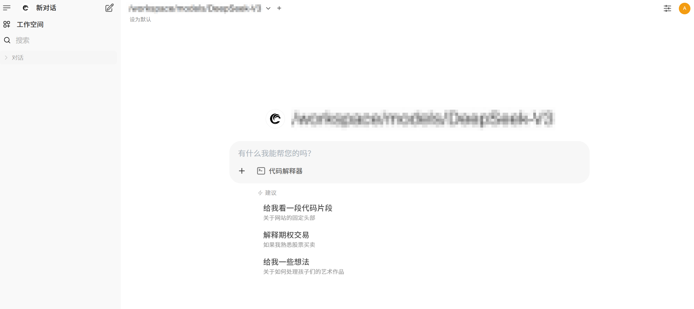
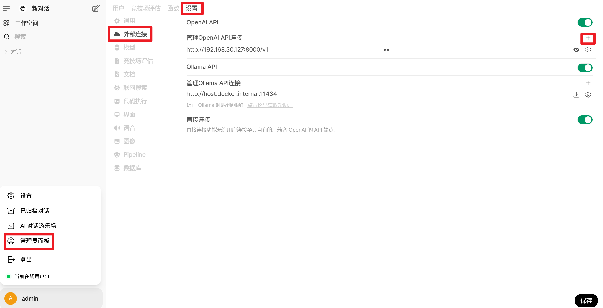
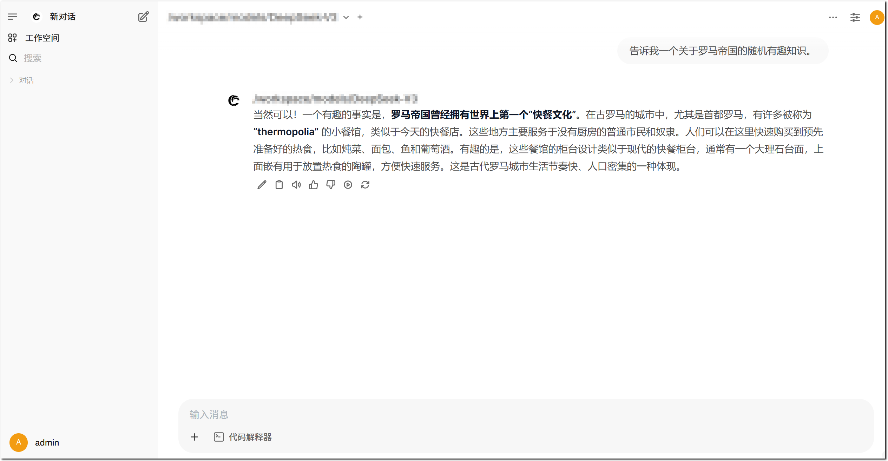

# 概述 

本文档旨在指导用户如何基于 vLLM 和 Open WebUI 在瀚博硬件设备上部署 Qwen3 系列模型，以及测试模型的精度和性能。

# 硬件要求

部署 Qwen3-30B-A3B-FP8 模型进行推理至少需要单卡VA16（1 x 128G）或单卡VA1L(1 x 64G) 或单卡 VA10L(1x128G)。

# 版本信息

本次发布软件版本为 [AI3.0_SP9_0811](https://developer.vastaitech.com/downloads/delivery-center?version_uid=446043877774856192)。

当前推荐版本组合：
| 组件 |  版本|
| --- | --- |
| Driver | V3.3.0|
| torch | 2.7.0+cpu|
| vllm | 0.9.2+cpu|
| vllm_vacc| AI3.0_SP9_0811|

## 支持的模型

当前支持的模型如下所示：

- [Qwen3-30B-A3B-FP8](https://www.modelscope.cn/models/Qwen/Qwen3-30B-A3B-FP8)

- [Qwen3-30B-A3B-Instruct-2507-FP8](https://www.modelscope.cn/models/Qwen/Qwen3-30B-A3B-Instruct-2507-FP8)

- [Qwen3-30B-A3B-Thinking-2507-FP8](https://modelscope.cn/models/Qwen/Qwen3-30B-A3B-Thinking-2507-FP8)

模型下载步骤如下所示。

1. 安装 ModelScope。

```shell
pip install modelscope -i https://mirrors.ustc.edu.cn/pypi/web/simple 
export PATH=$PATH:~/.local/bin
```

2. 根据实际情况选择对应的模型下载。

其中，“`$Path`”为模型保存路径，“`$Model_Name`”为模型名称，如下所示，请根据实际情况替换。

`$Model_Name`：

- Qwen3-30B-A3B-FP8
- Qwen3-30B-A3B-Instruct-2507-FP8
- Qwen3-30B-A3B-Thinking-2507-FP8


每个模型大小约为31GB,下载时请确保“`$Path`”所在的磁盘存储空间是否足够。


下载过程中如果出现某个文件下载失败的情况，可等命令执行完成后重新执行该命令，继续下载未下载完成的文件。


```shell
modelscope download --model Qwen/$Model_Name --local_dir $Path/$Model_Name
```


## 注意事项

在当前硬件配置下，测试模型性能和精度时需注意以下限制条件：

- 如果 TP 为 2，模型最大上下文长度为 64K；如果TP 为 4，模型最大上下文长度为 128K。

- 模型同时支持最大并发数为 4。

- 单并发最大输入长度为 56K。

- 对于超出上下文长度的请求，服务端会拦截不做处理，客户端需自行校验请求长度。


# 环境安装

## 前提条件

- 部署模型服务前请检查部署环境是否满足[《基础环境要求》](https://developer.vastaitech.com/downloads/delivery-center?version_uid=446043877774856192)。


- 部署模型服务前请确保已从[开发者中心](https://developer.vastaitech.com/downloads/delivery-center?version_uid=446043877774856192)下载配套版本的驱动（Driver）和《PCIe 驱动安装指南》，并按指南完成驱动安装。


- Docker Compose 版本需为 v1.29及以上版本，否则执行指令时可能会出现异常。

  - 如果 CPU 是 x86 架构，Docker Compose 安装指令如下所示。
```shell
wget https://github.com/docker/compose/releases/download/v2.26.1/\
     docker-compose-linux-x86_64 -O /usr/local/bin/docker-compose
chmod +x /usr/local/bin/docker-compose
```

  - 如果 CPU 是 ARM 架构，Docker Compose 安装指令如下所示。
```shell
wget https://github.com/docker/compose/releases/download/v2.37.2/\
     docker-compose-linux-aarch64 -O /usr/local/bin/docker-compose
chmod 
```

## 启动Qwen3服务

**步骤 1.** 获取[vllm_vacc 服务部署包](../common/haproxy)包。

假设存放路径为“/home/username”，请根据实际情况替换。


**步骤 2.**  启动 Qwen3 服务。

> 本文档主要介绍如何使用 “deploy.py”脚本启动模型的 Qwen3 服务。。

>如果需要使用原生vllm 在线启动服务，可参考[vllm 在线服务使用说明](../common/online_example_README.md);

>如果需要使用原生vllm 离线推理方式，可参考[vllm 离线推理说明](../common/offline_example_README.md)

下面以deploy.py 启动方式详细说明：

对于Qwen3-30B-A3B-FP8模型，启动命令：
```shell
cd /home/username/haproxy
python3 deploy.py --instance 8 \
    --tensor-parallel-size 4 \
    --image harbor.vastaitech.com/ai_deliver/vllm_vacc:AI3.0_SP9_0811 \
    --model /home/username/weights/Qwen3-30B-A3B-FP8 \
    --port 8000 \
    --management-port 9000 \
    --max-batch-size-for-instance 4 \
    --served-model-name Qwen3 \
    --max-model-len 65536 \
    --reasoning-parser qwen3 \
    --enable-qwen3-rope-scaling \
    --enable-auto-tool-choice \
    --tool-call-parser hermes 
```
对于Qwen3-30B-A3B-Instruct-2507-FP8模型，启动命令：
```shell
cd /home/username/haproxy
python3 deploy.py --instance 8 \
    --tensor-parallel-size 4 \
    --image harbor.vastaitech.com/ai_deliver/vllm_vacc:AI3.0_SP9_0811 \
    --model /home/username/weights/Qwen3-30B-A3B-Instruct-2507-FP8 \
    --port 8000 \
    --management-port 9000 \
    --max-batch-size-for-instance 4 \
    --served-model-name Qwen3 \
    --max-model-len 65536 \
    --enable-auto-tool-choice \
    --tool-call-parser hermes 
```

对于Qwen3-30B-A3B-Thinking-2507-FP8模型，启动命令：
```shell
cd /home/username/haproxy
python3 deploy.py --instance 8 \
    --tensor-parallel-size 4 \
    --image harbor.vastaitech.com/ai_deliver/vllm_vacc:AI3.0_SP9_0811 \
    --model /home/username/weights/Qwen3-30B-A3B-Thinking-2507-FP8 \
    --port 8000 \
    --management-port 9000 \
    --max-batch-size-for-instance 4 \
    --served-model-name Qwen3 \    
    --reasoning-parser qwen3 \
    --max-model-len 65536 \
    --enable-auto-tool-choice \
    --tool-call-parser hermes 
```

参数说明如下所示。
    
- `--instance`： 模型推理实例。参数要求 instance 设定值 * tensor-parallel-size设定值 <= 推理核心数 
>注： 推理核心数可通过：vasmi list --display-format=json | grep -o "aic" | wc -l 查询

- `--tensor-parallel-size`：张量并行数, 目前Qwen3 系列支持 TP2 对应参数：“--tensor-parallel-size 2” ; TP4 对应参数：“--tensor-parallel-size 4”

- `--image`：模型服务镜像。

- `--model`：原始模型权重所在路径。请根据实际情况替换。

- `--port`：模型服务端口。

- `--management-port`：管理端口。

- `--max-batch-size-for-instance`：每个实例的最大 Batch Size，最大支持4。

- `--served-model-name`：模型名称。

- `--max-model-len`：模型最大上下文长度，TP4 最大支持128k上下文，TP2 最大支持64k上下文

- `--reasoning-parser`：指定用于从模型输出中提取推理内容的推理解析器, 可选 qwen3/deepseek_r1

- `--enable-qwen3-rope-scaling`：是否启动 Qwen3 模型的 RoPE 缩放功能，使模型最大上下文长度超过32K, 仅 Qwen3-30B-A3B-FP8 模型需要设置该参数。

- `--enable-auto-tool-choice`：是否启用自动工具选择功能，使模型能够根据用户输入自动决定是否需要调用工具（如 API、函数），并选择最合适的工具。

- `--tool-call-parser`：设置工具调用解析器，用于解析模型的输出中是否包含工具调用请求，并将其转换为结构化格式（如 JSON）。对于Qwen3系列模型，需设置为 hermers。

>注意思考和非思考模式具体可参考[Qwen官方文档说明](https://qwen.readthedocs.io/zh-cn/latest/inference/transformers.html#thinking-non-thinking-mode)


启动完成后显示如下类似信息。
```shell
Deployment configuration updated successfully.
Docker containers started successfully.
All instances are up and running
```

**步骤 3.** 查看 Qwen3 服务的输出日志。

```bash
tail -f llm_serve_0.log
```


**步骤 4.** （可选）停止 Qwen3 服务。

如果需停止服务，可执行该步骤。
[docker-compose.yaml](../common/haproxy/docker-compose.yaml)
```bash
docker-compose -f docker-compose.yaml down
```


# 测试模型性能

模型性能包含吞吐和推理时延，可通过 vLLM 服务加载模型，并使用 vLLM 自带框架进行性能测试。

## vLLM 自带框架测试模型性能

通过 vLLM 自带框架进行模型测试的指令如下所示，所在路径为容器（启动 vLLM 服务的容器）内的“/test/benchmark”目录下。

```shell
python3 benchmark_serving.py \
    --host <IP> \
    --port <Port> \
    --model <model_path> \
    --dataset-name random \
    --num-prompts <num> \
    --random-input-len <input_len> \
    --ignore-eos \
    --random-output-len <output_len> \
    --max-concurrency <concurrency> \
    --served-model-name <model_name> \
    --server-num <server_num> \
    --save-result \
    --result-dir <result> \
    --result-filename <result_name>
```


其中，参数说明如下所示。


- `--host`：vLLM 推理服务所在 IP 地址。

- `--port`：vLLM 推理服务端口，需在“qwen3-30b-docker-compose.yaml”中查看确认。

- `--model`：原始模型权重文件所在路径。和 vLLM 推理服务启动时设置的模型路径一致。

- `--dataset-name`：数据集名称。

- `--num-prompts`：测试时使用的输入数据数量。

- `--random-input-len`：输入序列的长度。

- `--ignore-eos`：用于控制生成文本时是否忽略模型的 EOS（End-of-Sequence） Token，即结束标记，如 `<|endoftext|>` 或 `</s>`。

- `--random-output-len`： 输出序列的长度。

- `--max-concurrency`：最大请求并发数。

- `--served-model-name`：API 中使用的模型名称。
  - 如果通过一键安装启动vLLM 服务， 该参数设置应与<Model_Type>一致，设置为 Qwen3-TP2 或 Qwen3-TP4 
  
  - 如果是通过分步安装启动vLLM 服务，该参数设置应与deploy.py 启动脚本中“--served-model-name” 参数一致

- `--save-result`：是否保存测试结果。如果设置该参数，则测试保存至`--result-dir` 和 `--result-filename` 指定的路径。

- `--result-dir`：测试结果保存目录。如果不设置，则保存至当前路径。

- `--result-filename`：测试结果文件名称。

- `--server-num`: 与deploy.py 启动参数 `--instance` 一致


本节以 Qwen3-30B-A3B-FP8 模型为例进行说明如何测试模型性能。

**步骤 1.** 启动 vLLM 服务。

**步骤 2.** 测试Qwen3-30B-A3B-FP8模型性能。

```shell
docker exec -it  vllm_service bash
cd /test/benchmark
mkdir benchmark_result
export OPENAI_API_KEY="token-abc123"
python3 benchmark_serving.py \
    --host <IP> \
    --port 8000 \
    --model /weights/Qwen3-30B-A3B-FP8 \
    --dataset-name random \
    --num-prompts 5 \
    --random-input-len 128 \
    --ignore-eos \
    --random-output-len 1024 \    
    --max-concurrency 1 \
    --served-model-name Qwen3 \
    --save-result \
    --result-dir ./benchmark_result \
    --result-filename result.json     
```
其中，“vllm_service”为 vLLM 服务容器名称，可通过`docker ps |grep vLLM`查询；“host”为本机ip地址。


本次测试使用“/test/benchmark/benchmark.sh”进行批量测试。


## 性能结果指标说明

- Maximum req： 最大并发数。

- Duration：请求测试耗时。

- Successful req：请求总数。

- input tokens：输入Token数量。

- generated tokens：输出Token数量。

- Req throughput：每秒处理的请求数。

- Output token throughput：每秒输出Token数量。

- Total Token throughput：每秒生成Token数量。

- Mean TTFT ：从用户发送请求到模型生成第一个 Token 的平均时间。

- Mean TPOT：模型生成每个输出 Token 所需的平均时间。

- Decode Token throughput：Decode阶段每秒输出Token数量。

- Per-req Decoding token throughput：Decode阶段平均每个用户每秒输出Token数量。


# 测试模型精度


模型精度测试通过 vLLM 服务加载模型，并使用 vaeval 进行评估。vaeval 工具基于 EvalScope 二次开发，EvalScope 说明可参考[EvalScope 用户手册](https://evalscope.readthedocs.io/zh-cn/latest/index.html)。

EvalScope 支持基于原生数据集进行精度测试，也支持基于自定义数据集进行测试。不同的数据集其精度测试配置文件不同。

使用原生数据集进行精度测试，配置文件如下所示，单击[config_eval_qwen3.yaml](./config/config_eval_qwen3.yaml)获取。EvalScope支持的原生数据集可参考[EvalScope支持的数据集](https://evalscope.readthedocs.io/zh-cn/latest/get_started/supported_dataset/llm.html)。

```yaml
# vaeval 评估配置文件
model: "Qwen3"
api_url: "http://localhost:8000/v1/chat/completions"
api_key: "EMPTY"
eval_type: "service"
work_dir: "./outputs_eval_qwen3"

datasets:
  - "mmlu_pro"
  - "drop"
  - "ifeval"
  - "gpqa"
  - "live_code_bench"
  - "aime24"
  - "math_500"
  - "ceval"

dataset_args:
  mmlu_pro:
    subset_list: ["computer science", "math", "chemistry", "engineering", "law"]
  gpqa:
    subset_list: ["gpqa_diamond"]
  ceval:
    subset_list: ["computer_network", "operating_system", "computer_architecture", "college_programming", "college_physics"]

eval_batch_size: 32

generation_config:
  max_tokens: 61440
  temperature: 0.6
  top_p: 0.95
  n: 1

stream: true
timeout: 6000000
limit: 50                             
```

参数说明如下所示。
- model：模型名称。
  - 如果通过一键安装启动vLLM 服务， 该参数设置应与<Model_Type>一致，设置为 Qwen3-TP2 或 Qwen3-TP4 
  
  - 如果是通过分步安装启动vLLM 服务，该参数设置应与deploy.py 启动脚本中“--served-model-name” 参数一致


- api_url：vLLM 服务地址。

- api_key：API 密钥。默认值：Empty。

- eval_type：评测类型，设置为service。


- work_dir：评测结果保存路径。

- datasets：数据集名称。支持输入多个数据集，数据集将自动从modelscope下载。

- dataset_args：数据集参数

  - subset_list：评测数据子集列表，指定后将只使用子集数据。

- eval_batch_size：评测批次大小。

- generation_config：生成参数。

  - max_tokens：生成的最大Token数量。

  - temperature：生成温度。

  - top_p：生成top-p。

   - n： 生成序列数量。

- stream：是否使用流式输出，默认值：false。

- timeout：请求超时时间。

- limit：每个数据集最大评测数据量，不填写则默认为全部评测，可用于快速验证。


使用自定义数据集进行精度测试，配置文件如下所示，单击[config_eval_general_mcq_qwen3](./config/config_eval_general_mcq_qwen3.yaml)获取。自定义数据集格式要求可参考[大语言模型自定义评测数据集](https://evalscope.readthedocs.io/zh-大语言模型自定义评测数据集cn/latest/advanced_guides/custom_dataset/llm.html)。

```yaml
model: Qwen3
api_url: http://localhost:8000/v1/chat/completions
api_key: EMPTY
eval_type: service
datasets:
  - general_mcq
dataset_args:
  general_mcq:
    local_path: "/path/to/cluewsc_custom"
    subset_list:
      - "cluewsc"
    prompt_template: "以下问题的答案有AB两个选项，选出正确答案，请直接回答A或B\n\n{query}"
    eval_split: 'test'
generation_config:
  max_tokens: 61440
  temperature: 0.6
  top_p: 0.95
  n: 1
eval_batch_size: 32
limit: 50
stream: true
timeout: 6000000  
work_dir: ./outputs_eval_qwen3                                            
```

参数说明如下所示。

- model：模型名称。
  - 如果通过一键安装启动vLLM 服务， 该参数设置应与<Model_Type>一致，设置为 Qwen3-TP2 或 Qwen3-TP4 
  
  - 如果是通过分步安装启动vLLM 服务，该参数设置应与deploy.py 启动脚本中“--served-model-name” 参数一致

- api_url：vLLM 服务地址。

- api_key：API密钥。

- eval_type：评测类型，设置为service。


- datasets：自定义数据集名称

- dataset_args：数据集参数


   - general_xxx：自定义数据集名称，根据实际情况替换。

   - local_path：自定义数据集路径。

   - subset_list：自定义数据集子集名称。

   - prompt_template：Prompt模板，

   - eval_split：评测数据集划分。

- generation_config：生成参数

  - max_tokens：生成的最大Token数量。

  - temperature：生成温度。

  - top_p：生成top-p。

   - n： 生成序列数量。

- eval_batch_size：评测批次大小。

- limit：每个数据集最大评测数据量，不填写则默认为全部评测，可用于快速验证。

- stream：是否使用流式输出，默认值：false。

- timeout：请求超时时间。

- work_dir：评测结果保存路径。

本节以 Qwen3-30B-A3B-FP8 模型为例进行说明如何测试模型精度，其中数据集使用原生数据集。

**步骤 1.** 单击[config_eval_qwen3.yaml](./config/config_eval_qwen3.yaml)下载精度配置文件。

假设下载后目录为“/home/username”目录，请根据实际情况替换。

**步骤 2.** 启动 vLLM 服务。

**步骤 3.** 新打开一个终端拉取测试模型精度的镜像。

```shell
docker pull harbor.vastaitech.com/ai_deliver/vaeval:0.1 
```
>上述指令默认在 x86 架构的 CPU 环境中执行。如果 CPU 是 ARM 架构，则`harbor.vastaitech.com/ai_deliver/vaeval:0.1`需替换为`harbor.vastaitech.com/ai_deliver/vaeval:latest_arm`。
>
**步骤 4.** 在新打开的终端运行测试模型精度的容器。

```shell
docker run --ipc=host -it --ipc=host --privileged \
      --name=vaeval -v /home/username:/data harbor.vastaitech.com/ai_deliver/vaeval:0.1 bash
```
其中，“/home/username”为精度测试配置文件所在目录，请根据实际情况替换。

**步骤 5.** 根据实际情况修改精度测试配置文件。

```yaml
# vaeval 评估配置文件
model: "Qwen3"
api_url: "http://localhost:8000/v1/chat/completions"
api_key: "EMPTY"
eval_type: "service"
work_dir: "./outputs_eval_qwen3"

datasets:
  - "mmlu_pro"
  - "drop"
  - "ifeval"
  - "gpqa"
  - "live_code_bench"
  - "aime24"
  - "math_500"
  - "ceval"

dataset_args:
  mmlu_pro:
    subset_list: ["computer science", "math", "chemistry", "engineering", "law"]
  gpqa:
    subset_list: ["gpqa_diamond"]
  ceval:
    subset_list: ["computer_network", "operating_system", "computer_architecture", "college_programming", "college_physics"]

eval_batch_size: 32

generation_config:
  max_tokens: 61440
  temperature: 0.6
  top_p: 0.95
  n: 1

stream: true
timeout: 6000000
limit: 50                    
```


**步骤 6.**  测试 Qwen3-30B-A3B-FP8 模型精度。

```shell
conda activate vaeval
cd /data
vaeval eval config_eval_qwen3.yaml
```

# 启动 Open WebUI 服务

Open WebUI通过容器启动，本节以 Qwen3-30B-A3B-FP8 模型为例进行说明如何访问 Open WebUI。


**操作步骤**

**步骤 1.** 启动 vLLM 服务。

**步骤 2.** 新打开一个终端拉取 Open WebUI 镜像。
```shell
docker pull harbor.vastaitech.com/ai_deliver/vast-webui:latest
```

**步骤 3.** 启动 Open WebUI 服务。

```shell
docker run -d \
    -v vast-webui:/app/backend/data \
    -e ENABLE_OLLAMA_API=False \
    --network=host \
    -e PORT=18080 \
    -e OPENAI_API_BASE_URL="http://127.0.0.1:8000/v1" \
    -e DEFAULT_MODELS="/weights/Qwen3-30B-A3B-FP8" \
    -e DEFAULT_LOCALE="cn" \
    --name vast-webui \
    --restart always \
    harbor.vastaitech.com/ai_deliver/vast-webui:latest
```
>上述指令默认在 x86 架构的 CPU 环境中执行。如果 CPU 是 ARM 架构，则`harbor.vastaitech.com/ai_deliver/vast-webui:latest`需替换为`harbor.vastaitech.com/ai_deliver/vast-webui:latest_arm`。


其中，`OPENAI_API_BASE_URL`为 vLLM 服务地址，`DEFAULT_MODELS`为原始模型权重所在路径。请根据实际情况替换。


Open WebUI 服务启动后，即可通过[http://HostIP:18080](http://HostIP:18080)访问  Open WebUI。

其中，“HostIP” 为 Open WebUI 服务所在IP地址。


**步骤 4.** 访问 Open WebUI 页面，并根据界面提示注册账号并登录。

首次进入需设置管理员账号密码。设置完毕后，进入如下所示主页。




> 如果瀚博已提供环境，则默认用户名为“admin@vastai.com”，默认密码为“admin123”。


**步骤 5.** 连接 vLLM 服务并添加Qwen3-30B-A3B-FP8模型。


如果是普通用户，也可在“设置 > 外部连接”页签添加 vLLM服务和模型，但是添加后仅针对当前普通用户有效。


1. 在“管理员面板 > 设置 > 外部连接”页签的“管理 Open API 连接”栏单击“+”。




2. 在“添加一个连接”页面配置 vLLM 服务地址、密钥和Qwen3-30B-A3B-FP8模型地址并保存。

-  vLLM 服务地址格式：http://HostIP:Port/v1。其中，HostIP 为 vLLM 服务所在地址，Port 为 vLLM 服务端口。

- 密钥：API密钥，需配置为“token-abc123”。

- 模型地址：原始模型权重文件所在路径。


3. 在“管理员面板 > 设置 > 界面”页签禁用下图红框中的功能以防止 Open WebUI 自动调用大模型执行红框中的功能。


**步骤 6.** 开启一个新对话进行简单体验。




本节仅简单说明如何使用 Open WebUI。详细使用说明可参考[https://openwebui-doc-zh.pages.dev/features/](https://openwebui-doc-zh.pages.dev/features/)。