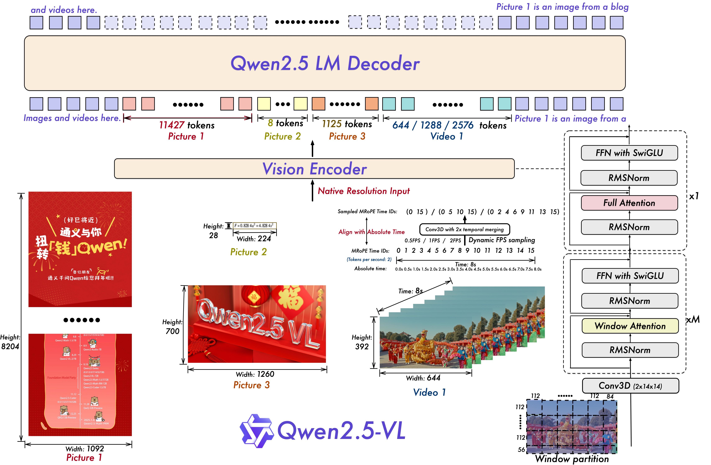

# Qwen2_5_VL

- [Qwen2-VL: Enhancing Vision-Language Model's Perception of the World at Any Resolution](https://arxiv.org/pdf/2409.12191)
- https://hf-mirror.com/Qwen/Qwen2.5-VL-7B-Instruct

## Model Arch


### pre-processing

#### text encoder
- text encoder的预处理仅需要经过tokenizer转为相应token序列(预插入了image占位符)

#### image encoder
- 传统预处理包括：to_rgb -> to_array -> resize -> rescale -> normalize
- 以及后续特殊预处理（经VDSP自定义算子实现）：tile -> reshape -> transpose -> reshape
- 最后由image patches经patch_embed后进入VIT输出image_embeds

### post-processing
- llm decoder

### backbone
- `Qwen2.5_VL`由`VIT Trained from scratch`和`Qwen2.5`构成，通过`MLP`将视觉模型和语言模型进行对齐
- 较Qwen2_VL，Visual部分，将LayerNorm改为RMSNorm方式，与和LLM部分对齐

### common

- 时间和图像尺寸的感知

    在空间维度上，Qwen2.5-VL 不仅能够动态地将不同尺寸的图像转换为不同长度的 token，还直接使用图像的实际尺寸来表示检测框和点等坐标，而不进行传统的坐标归一化。这使得模型能够直接学习图像的尺度。在时间维度上，引入了动态 FPS (每秒帧数)训练和绝对时间编码，将 mRoPE id 直接与时间流速对齐。这使得模型能够通过时间维度 id 的间隔来学习时间的节奏。
    在Qwen2-VL中，时间方向每帧之间固定间隔 1 ，没有考虑到视频的采样率，例如四秒的视频每秒采样两帧和一秒的视频每秒采样八帧，这样总的帧数都是8，在原来这种编码方式中时间维度的编码都是1->8没有任何区别。Qwen-2.5VL在时间维度上引入了动态 FPS (每秒帧数)训练和绝对时间编码，将 mRoPE id 直接与时间流速对齐。这使得模型能够通过时间维度 id 的间隔来学习时间的节奏。

- 更简洁高效的视觉编码器

    视觉编码器在多模态大模型中扮演着至关重要的角色。我们从头开始训练了一个原生动态分辨率的 ViT，包括 CLIP、视觉-语言模型对齐和端到端训练等阶段。为了解决多模态大模型在训练和测试阶段 ViT 负载不均衡的问题，我们引入了窗口注意力机制，有效减少了 ViT 端的计算负担。在我们的 ViT 设置中，只有四层是全注意力层，其余层使用窗口注意力。最大窗口大小为 8x8，小于 8x8 的区域不需要填充，而是保持原始尺度，确保模型保持原生分辨率。此外，为了简化整体网络结构，我们使 ViT 架构与 LLMs 更加一致，采用了 RMSNorm 和 SwiGLU 结构。




### train
- 在Qwen2-VL基础上，Qwen2.5-VL除了pretrain、SFT，还用了DPO
‒ 预训练数据：1.2万亿token ---> 4.1万亿token
‒ ViT没有设置初始权重，在私有数据从头开始训练，训练过程包含包括 CLIP 预训练、视觉-语言对齐和端到端微调
‒ video：20分钟--->1小时理解
‒ 全面的文字识别和理解，增强文字bounding boxes能力， QwenVL HTML 格式文档解析（layerout）
‒ 增强结构化输出能力

## TVM_VACC部署

### step.1 模型准备

1. 下载模型权重

    | models  | tips |
    | :---: | :--: |
    | [Qwen/Qwen2.5-VL-3B-Instruct](https://hf-mirror.com/Qwen/Qwen2.5-VL-3B-Instruct) |[modeling_qwen2_5_vl_vacc.py](./build_in/source_code/modeling_qwen2_5_vl_vacc.py) |
    | [Qwen/Qwen2.5-VL-7B-Instruct](https://hf-mirror.com/Qwen/Qwen2.5-VL-7B-Instruct) |[modeling_qwen2_5_vl_vacc.py](./build_in/source_code/modeling_qwen2_5_vl_vacc.py) |
    | [Qwen/Qwen2.5-VL-32B-Instruct](https://hf-mirror.com/Qwen/Qwen2.5-VL-32B-Instruct) | [modeling_qwen2_5_vl_vacc.py](./build_in/source_code/modeling_qwen2_5_vl_vacc.py) |

2. 网络修改
    - 为了方便部署`Qwen2.5-VL`系列模型，在官方源码的基础上，需要对`modeling_qwen2_5_vl.py`进行适当修改
    - 修改后：[modeling_qwen2_5_vl_vacc.py](./build_in/source_code/modeling_qwen2_5_vl_vacc.py)


### step.2 获取数据集

- vlm模型基于`evalscope`工具进行精度测评，数据集参考：[supported_dataset](https://evalscope.readthedocs.io/zh-cn/latest/get_started/supported_dataset.html#vlmevalkit)

### step.3 模型转换
1. 根据具体模型修改配置文件：
    - [qwen2_5_vl_llm.yaml](./build_in/build/qwen2_5_vl_llm.yaml)
    - [qwen2_5_vl_visual.yaml](./build_in/build/qwen2_5_vl_visual.yaml)

    ```bash
    vamc compile ./build_in/build/qwen2_5_vl_llm.yaml
    vamc compile ./build_in/build/qwen2_5_vl_visual.yaml
    ```

### step.4 模型推理

1. 获取大模型部署推理工具：[vastgenx: v1.1.0+](../../docs/vastgenx/README.md)
2. 精度评估参考：[vastgenx-精度测试](../../docs/vastgenx/README.md#-精度测试)
3. 性能评估参考：[vastgenx-性能测试](../../docs/vastgenx/README.md#-性能测试)

### Tips
- VACC部署中，拆分为两个模型进行推理，Visual部分不切分，LLM部分可TP切分
- Visual部分
    - 计算最佳图像尺寸Smart_Resize操作在CPU上实现，其它缩放、均值方差、归一化在VDSP上实现
    - visual部分的旋转位置编码在VDSP自定义算子上实现，需要把sin/cos置前，通过参数传入
    - 模型输出`image_embeds`数据量太大([1280,3584])，由于硬件限制，compile会切成6份输出，前5份[1280,640]，最后一份[1280,384]
    - 模型编译耗时7小时，推理时加载需6分钟（和attention_split_num及ffn_split_num参数相关）
    - 关于visual部分尺寸限制，以720P(720x1280)为例
        - 首先，宽高将缩放至最接近28倍数值上（728x1288）；
        - 在VIT计算时将转换为(728//14) x (1288//14) = 4784 patch
        - 在编译visual部分三件套时，设置稍大于4784的值（且需为16的倍数），如5120
        - 在visual部分转换为token时，有相邻patch-merge操作(2x2)，最终visual-token=5120//4=1280
        - 因此，在llm部分的prefill阶段seq-length需大于1280，如设置为2048
- LLM部分
    - 3D旋转位置编码MROPE的`get_rope_index`在CPU上实现
- Visual部分基于VSX推理，bs=1，每次只能处理一张图片；通过消息队列向LLM部分传递，最后输出文本回答
- 精度测试可测试多个数据集：
    - MMBench_DEV_EN
    - MMBench_DEV_CN
    - MMMU_DEV_VAL
    - OCRBench
- Qwen2.5_VL依赖的transformers版本较新：
    ```
    # 注意，transformers官方在python3.8下只支持到4.47；所有此模型需要python3.10
    transformers==4.51.3
    huggingface-hub==0.30.2
    ```

- input_ids转为embedding部分，需要使用从预训练模型获取的embedding权重：[emb_tokens.bin](http://192.168.20.139:8888/vastml/modelzoo/vlm/Qwen/Qwen2.5-VL-7B-Instruct/emb_tokens.bin)
    ```python
    import torch
    import numpy as np
    from transformers import AutoTokenizer, AutoModelForCausalLM, AutoModel

    model_name = "./vlm/Qwen/Qwen2.5-VL-7B-Instruct"

    model = AutoModel.from_pretrained(
        model_name,
        trust_remote_code=True,
        torch_dtype=torch.float16,
        device_map="auto"
    )
    embed_tokens = model.embed_tokens.weight.data
    embed_tokens.cpu().numpy().tofile("embed_tokens.bin")
    print(f"embed_tokens shape: {embed_tokens.shape}")
    ```


## TORCH_VACC部署

|  model |  script  | tips |
| :------: | :------: | :------: |
 | [Qwen/Qwen2.5-VL-3B-Instruct](https://hf-mirror.com/Qwen/Qwen2.5-VL-3B-Instruct) |[qwen2_5_vl.py](./pytorch/qwen2_5_vl.py)|  |
| [Qwen/Qwen2.5-VL-7B-Instruct](https://hf-mirror.com/Qwen/Qwen2.5-VL-7B-Instruct) |[qwen2_5_vl.py](./pytorch/qwen2_5_vl.py)|  |

> 基于`torch_vacc`在`VA16`硬件下推理，一般基于官方demo进行适当修改
